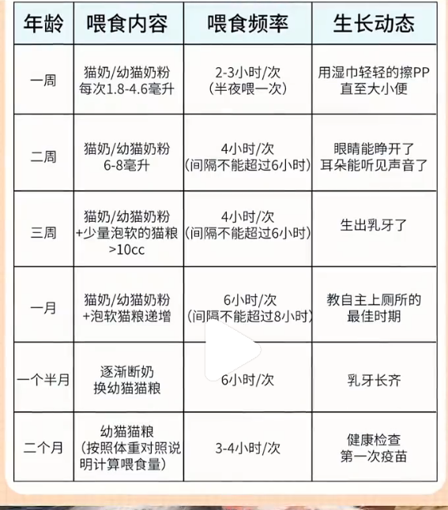

# 养猫笔记

# 前言
想养猫，但短期内显然是没太有明显的机会了，遂决定先把养猫需要做的准备调研先整明白先。

讲道理，自我感觉许
多问题和许多事情更多的其实可以在养猫之前

做好准备。虽然到时候肯定也会少不了临场出问题现场找人现场找解决方法，
但是一件事情心里有底心里没底的感受是完全不一样的。

我想让我家的毛孩子有着更好的保护！（理论上）

于是决定先把养猫的计划做好，又或者说提前做一些先期准备。对我自己而言，如果说连先期准备都不愿意做，又或者说准备准备着就打起退堂鼓了……那不如不养。

所以先做准备，先劝退自己，如果劝不退，那就差不多可以养了。

其他的，也将自己的总结发出来，一方面希望能帮到有需要的人，另一方面也希望有了解的养猫的各位家长帮忙参考参考意见提一点建议什么的。

目前整理材料进度（收藏夹内材料已整理37/共37）

# 其他注意事项
1. 味道：猫或多或少会新增家里的味道（猫粮的，排泄的等），即使打扫勤快也会有味道
2. 过敏：有的人会在养猫两三年后忽然过敏，过敏源可能是猫毛，猫皮屑等，严重者会引发哮喘威胁生命，吃药可以缓解但不能根治，尤其是小孩老人等等免疫力较差群体易感
3. 卫生注意：有些猫会软便粘在屁股上，腿上，尾巴上（尤其长毛猫，矮脚猫），养猫可能会发现猫砂满屋都能找到，就是忽然这里发现一点，那里发现一点
4. 强迫症注意：有些强迫症或者喜欢独居不喜欢别人碰你东西的，也不适合养猫。毕竟有些猫会跑酷，半夜叫唤，撞花瓶，刮花窗帘沙发等等，打乱个人的生活秩序感
5. 有的猫脑子不好使：猫的脑容量低，很难听懂指令，不能教育，会记仇，剪指甲可能会挣扎，洗澡可能会挣扎，好端端撸猫可能会突然抓一下咬一下，没有缘由的那种
6. 生病：花费时间金钱最好要提前有概念
7. 低能量者注意：每天回家需要干以下活：铲屎，洗猫碗，给猫梳毛，擦耳朵，擦眼睛，擦屁股，陪玩等，干完这些不少时间就过去了。
8. 掉毛：猫一年掉两次毛，一次掉半年哈哈哈。勤梳毛也许会有一定帮助。
9. 乱尿：部分猫会乱尿（感觉也有一定教育问题？），猫生气会报复，需要接受这些前提。有的猫这个问题在绝育后会有改善。
10. 影响睡眠：有的人养猫睡得更好，也有的人养猫被猫折磨不好睡觉，得想想办法。猫是夜行生物，想不夜间跑酷可能就那句“白天不熬猫，晚上猫熬人？”。
11. 离别：猫的生命就十几年，陪伴不了一生。

## 养猫劝退事项
现在还没养猫，但是想养直接劝退，这是为何就网上给你呈现的可爱好玩情绪价值全是美好全是正面
，来院长带你看看你看不到的背面，

### 掉毛
第一个吊毛他就没有不掉毛的毛，除非是无毛这玩意就油，
那么我就给你哭哭掉，你要是白收拾家还懒得贼死，快拉倒，别闹了。

### 制造焦虑
第二个焦虑，网上告诉你养猫能缓解焦虑，可别听他们泡了老鼻子养猫第一年焦虑的睡不好觉了，
脑瓜子一堆问号，晚上还咔咔一堆人给你制造焦虑，从你兜里掏钞票太没有人性了。

### 味道大
第三个味大小猫自己。都不臭，但是他拉的他自己都嫌臭咔咔美，还有没绝育的公猫尿味老猛了，
你要再舍不得钱买除臭好点的猫砂味老大了，体验感老。
差了别给自己找罪受了，这不扯你们

### 情绪价值
第四个烧钱情绪价值是靠花钱买来的朋友猫粮猫砂驱虫看病乱七八糟的啥不得钱
，院长早帮你算过了一个月300还是下点功夫下点功能科普的一些大坑都避开，
要是那挣钱费劲的你。谢谢院长，你先别买猫先把自己养好。

### 发情期
第五个发球等武装发球嗷嗷叫，人家邻居都别想好好睡觉，那公猫发情爱乱尿
，老想往出跑，脾气还容易暴躁，这些你接受不了，还舍不得花钱去绝育，
你快拉倒别扯蛋了。

### 猫手欠
第六个那嘴欠手也欠小时候有天有地有空气，咱们玩都想扒拉扒拉看看怎么个事儿咬口看看什么味，
沙发窗帘数据线都给你霍霍打碎一个东西更是家常便饭，这些你都得提前想好，

### 长期计划
第七个十几二十年的累赘，这时间可不短，中间搬家换城市，
处对象分手结婚生孩子，你都得考虑他咋整，你半道后悔的大猫没人爱要弃养的话
，家养的宠物猫很难在外面回去，我奉劝你别一时冲动。

# -1. 养猫渠道
## -1.1 集中领养
去哪领养呢

## -1.2 猫舍
去哪买呢？

## -1.3 个人领养
个人领养有没有需要注意的呢？

## -1.4 路边抓
真的可以吗哈哈哈，有什么需要注意的呢？
1. 首先，先来一套入户体检（医院肯定知道）
2. 然后驱虫

然后好像1个月之前的猫咪养起来是地狱难度，一个月后的猫咪出了新手村容易养一点

# 0. 接猫前注意事项
## 0.1 布置猫窝/安全角
提前给幼猫/猫猫准备一个可以躲起来的角落，给被巨人忽然抓走的猫猫一个起码看起来安全的藏身之处。

建议：
1. 安静人少的房间
2. 记得封窗
3. 清空家里危险物品，将易碎的容易掉落的东西提前安置好，家里有对猫有毒的植物清走。

## 0.2 必备物品

### 1. 幼猫粮
（必要性如何说明？）

### 2. 浅口陶瓷碗（喝水的？）：

防止胡须敏感，不易有细菌（大碗，或者笔洗，不容易打翻）

然后就是水碗和猫碗，我们家有长腿有短腿，所以说支架可放可不放，深口碗和浅口碗都要有的，小猫它是推土机，所以就最好使用牲口碗

### 3. 开放式大猫砂盆（长大也不用换）
第三个就是猫砂盆一定要选最大号的，最好是敞开口的，最大号的小猫可以在里面无限程度的转弯，然后空间也很大，所以小猫都会很小。

### 4. 猫砂：
矿砂（说是颗粒更细，脚感舒适，但是不同种类区别在哪呢？）

### 5. 猫窝（毯子）：
最好是有猫用过的？（区别在哪）有猫咪的气味，它会熟悉的更快

### 6. 航空箱：
航空箱或者猫包

航空箱有两种可以选择，一个是猫包，这个猫包特别小，可以再领养小猫的时候可以领回来航空箱比较实用，就是他大猫小猫都可以用，特别是你以后要出门给他打疫苗或者是干什么事情的时候，他都可以随时立随时走

### 7. 猫抓板
然后第二个是猫抓板，如果你家的沙发或者是窗帘，什么的不想遭殃的话，就在家里面给他多准备一点猫砂板，最好准备一些简单便宜高效可以贴的，或者是直接买地毯，像我花里胡哨的很漂亮，但是其实不实用，你看里面小猫都没怎么去抓过

我不是故意抓烂沙发的,你可以给我
准备猫抓板,让我从小就习惯在猫抓板
上磨爪子

### 8. 梳毛梳子
111

### 9. 储粮桶（米桶）：
储粮桶就是一个米桶，很简单很方便，如果说见底了，把它这样歪斜一下子就可以倾倒过来，拿去也很方便

### 10.猫砂铲
第四个猫砂铲，猫砂铲的话就选一个大号的这种镂空就可以了，猪毛梳子，不论你是你家长毛还是短毛都可以用的，

### 11.餐垫（可选）
猫粮罐头这些猫粮罐头零食大家可以随机选择，然后我这里还准备了一个餐垫，因为有些小猫它吃饭是会漏嘴的，它就会直接掉到餐垫上面，我就比较好清洗。.

## 0.3 怎么选猫
### 性别
#### 公猫
·特征:体型大、易发腮,长相壮实憨厚。
·优点:绝育成本低,恢复快。
·缺点:发情易乱尿;泌尿问题风险
提醒:橘猫多为公猫;隐睾猫绝育责且有
遗传风险,建议1岁后绝育。

#### 母猫
·特征:体型小,长相秀气柔美。
优点:性格安静,发情不乱尿。
·缺点:绝育成本高,恢复期长。
·提醒:三花多为母猫;不绝育易子宫蓄
脓,绝育避开发情期。

### 怎么避免选到病猫
选猫避坑 - 优先领养，拒绝折耳
(先天基因缺陷，终身痛苦)

最佳月龄 - 别接 2 月龄以下 (体弱未成熟)
选 3 月龄 (猫德好、体质稳)

健康自查 - 眼鼻干净无分泌物；
鼻头微润无鼻涕；耳朵干净无耳螨；
四肢健壮；毛发顺滑无癖斑

手续保障 - 确认已驱虫 + 打疫苗，
核对疫苗本。明确售后
约定退 / 换 / 包治

到家要点
(猫瘟潜伏期 2-9 天),
到家不洗澡、
不强抱，让它先适应环境

### 不同种类猫的特点

#### 暹罗猫
性格:聪明热情,体质好、易饲养
注意:天冷毛发易变黑,需做好保暖

#### 布偶猫
性格:温顺颜值高,包容心强,适配有孩家
庭
注意:肠胃脆弱,饮食要清淡规律

#### 曼基康矮脚猫
性格:软萌黏人,运动量需求小
注意:胸腔窄,避免剧烈运动,关注呼吸

#### 德文卷毛猫
性格:亲人友好,几乎不掉毛,好打理
注意:售价偏高,提前做好预算

#### 斯芬克斯猫(无毛猫)
性格:脾气好,适合猫毛过敏人群
注意:体温调节差,皮肤易出油,需定期清
洁
#### 西森猫
性格:性格随和,体力好,爱互动
注意:长毛猫,需定期梳理毛发

#### 阿比西尼亚猫
性格:开朗独立,好饲养,适合上班族
注意:需适度陪伴,防止独处焦虑
#### 缅因猫
性格:温柔温顺,体型大、气场足
注意:食量大、排泄多,做好养护预算

#### 俄罗斯蓝猫
性格:安静忠诚,体质好,低敏易养
注意:性格胆小,适应新环境需耐心
#### 孟加拉豹猫
性格:亲人聪明,精力旺盛,毛色靓丽
注意:运动需求大,需备足玩具和猫爬架
#### 异国短毛猫(加菲猫)
性格:慵懒乖巧,安静不闹腾
注意:短鼻腔易有泪痕,定期清洁眼部
#### 波斯猫
性格:温顺优雅,颜值高
注意:易有泪痕,长毛需每日梳理

## 养猫选择建议
### 新手建议
美短

中华田园猫

英短

阿比西鸭

### 家里有小孩建议选择
德文

绸尔真实猫 猫

中华田园猫

### 上班族建议

中华田园猫

美短

孟加拉豹猫

西森真实

俄罗斯蓝猫

阿比西尼亚

### 喜欢颜值高的建议选择
布偶

矮脚

西森

## 上班族养猫建议
### 上班族养猫常见问题
早八就出门，晚六才到家的牛马打工人，如何在有限时间内体面地养好猫？
养猫多年，总结下来，打工人不方便养猫主要有如下几个情况：
1.猫咪晚间过于兴奋，凌晨又活跃，铲屎官无法保证充足睡眠
2.喂食没有办法特别精细化，如自己做科学配比的猫饭
3.过于忙的时候没有时间铲屎
4.受不了满天飞的猫毛，但是低电量模式下用心清理猫毛，实在是有心无力……
结合以上情况，我以自己的经验总结了一套【高效还不将就】的方法论。亲测有效，理性分享

# 1. 花费
所有事情最终都避不开一件东西——钱

所以先把必要的不必要的花销先大概预估，心理有个概念是有必要的事情

老刷到考虑新手养猫的帖子，焦虑养猫成本一个月多少钱要花。
看评论区估摸一大半新手要更焦虑和“清醒”了
我刚接猫2.5月大养到3岁大，没有生过大病，
跟大家说说真正平民（月薪5k+）第一次养猫的费用吧
	
1️⃣刚接猫前后一个月花了400-500💰
基础设施必要支出
140: 猫碗、猫砂盆 / 铲、航空箱、
主要是备齐基础设施，用的、玩的。基本不会频繁更换，除非用破了；或者为新鲜感埋单。

药品购齐基础的驱虫、清耳螨
200 内：大促买就够了
复制
药品购齐基础的驱虫、清耳螨这些，买一次抵大半年

2日常花销大约210-230/月
猫粮70-90/月:
预算不多,主要挑靠谱的平价品牌,买喵梵思和麦富迪比
较多
猫粮初期都是提前问的常吃的猫粮，过渡1个月。猫猫情绪、身体稳定下来才换粮
猫粮:100。初期都是提前问的常吃的猫粮,过渡1个
月。猫猫情绪、身体稳定下来再考虑换粮

冻干湿粮平价又靠谱的少60/月
冻干买朗诺比较多;湿粮会偶尔咬咬牙买点贵的,比如弗
列加特、鲜朗、小李子等,都国产进口大牌
biranova nola
鲜朗

猫砂:36,小猫一般10斤/月。就矿砂混木薯砂,市面
上销量高的都没有问题
猫砂就豆腐砂混木薯砂，市面上销量高的都没有大问题。这个搭配就是好用

猫砂固定支出75-100/月
猫猫6个月之后,10斤/月就远远不够了,一个月要使
15-20斤猫砂。我家主力军还是木薯砂+豆腐砂。木薯
砂-王贵皮/福丸/许翠花,靠他们撑起结团,其中王贵皮
性价比高点;豆腐砂福丸pidan,主要为了不带出

2️⃣日常花销大约210-230/月
饮食150内/月
预算不多，挑的都是平价品牌。猫粮就是喵梵思、麦富迪，做平价猫粮一把手；冻干湿粮平价又靠谱就比较少了。除了性价比高的，也偶尔咬咬牙买点贵的
猫砂固定支出75-100/月。
猫猫6个月之后，10斤/月就远远不够了，一个月要使15-20斤猫砂。我家主力军还是木薯砂+豆腐砂，结团友好+带出少
	
这些都是真实费用，已经能够把猫养得肥美了。养一只猫没有想象那么贵，别被“要花好多钱养猫”这种想法劝退。

## 1.1 固定花费
吃喝拉撒

## 1.2 一次性花费/长期花费
打针疫苗

# 2. 健康篇
长期注意事项

此外，每个季度驱虫，每年打疫苗，定时带猫洗澡，绝育（绝育风险低但是有）

有一部分人畜共患的病：猫藓会传染给人，驱虫不到位人有感染弓形虫等的风险。

第五，我可以吃剩菜剩饭，但是你给我吃的时候一定要把里面的洋葱挑出来，
因为洋葱中含有硫化物，它会破坏我身体里的红细胞，半颗洋葱就能让我去。

第六如果我出现了精神不好，食欲不佳，频繁去猫砂盆想拉拉不出来，这多半是我便秘了，
你在家给我喝点乳果糖口服液，1~2天这个问题就没有了

第七要是我总是不停的舔爪子，指尖又红又肿的，这是我指尖炎了，
你也不用着急，只需要买一个碘伏和红霉素软膏，
一天给我涂上两次很快就好了

## 2.1 体检

1. 每年体检一次（8岁以上半年一次）

## 2.2 疫苗
1. 猫三联必须打（猫三联是什么？（猫三联（核心）：防猫瘟、疱疹、杯状））
2. 狂犬疫苗看着打（什么情况算要打呢？）
3. 别太早打第一针：母源抗体没退，打了白打，还可能免疫失败
4. 别打太密：一年打多次三联=过度免疫，增加过敏/肿瘤风险
5. 生病、应激、刚换环境不打：免疫差，易出事
6. 不查抗体=盲打：成年后每1–3年查一次抗体，够了就不用补（打疫苗前需确认是否需要补）

除了驱虫,疫苗也要帮我接种,这样
才能预防一些重大疾病

### 1. 首针时间

#### 家养
- 家养：8周龄起，每3–4周1针，直到16周龄

#### 流浪

- 流浪/捡来：先养稳1–2周再打，别刚到家就打（一周后再打第一针疫苗）
- 第二针疫苗在第一针的四周后打，其间每天回家就开罐头补充营养
- 第三针疫苗在第二针的四周后打，期间可以准备断奶（小颗粒猫粮）、

三针都打完后的一周如果都没事，可以准备第一次洗澡了

### 2. 必打疫苗
- 猫三联（核心）：防猫瘟、疱疹、杯状
- 狂犬疫苗：满3月龄必打，每年/每三年按当地法规（网友备注：狂犬如果不出门没必要打）
不出门不打狂犬

### 3. 疫苗打完观察
- 留院观察30分钟再走，防急性过敏（脸肿、喘、休克）
- 回家1–2天精神差、食欲略降正常，超过2天就医

## 2.3 驱虫

虽然我很少外出,但也要定期给我驱
虫,不然感染寄生虫会让我特别难受,
对我的身体伤害也很大

(建议体外驱虫每个月1次,体内驱虫
3个月1次)

疫苗和驱虫
在猫咪身体健康的情况下，要及时接种猫三联和体内外驱虫，不能懈怠！

体内外有虫子的表现：体内有虫子会干吃不胖，屁股和他呆过的地方会有白色芝麻粒，严重点直接拉虫子了。体外的很明显，有耳螨的猫耳朵里会有黑色干燥的渣子。有跳蚤的猫毛里有很多黑点，用湿巾捏会变红，那是跳蚤粑粑

定期驱虫：体外每月一次、体内每三月打一次

最后一点就是要及时的给猫咪做驱虫，幼猫在28天以后就要做第一次的驱虫了，否则肚子里的寄生虫就会影响猫咪的免疫力，猫咪就会频繁生病，如果猫咪总是频繁用后脚撞到身体，用头在家蹭来蹭去拖着屁股走路，躺在地上来回打滚，千万不要以为这是猫咪调皮撒娇，这其实是它身上有寄生虫了，猫咪被咬得浑身难受，尤其是体内虫还会导致它日渐消瘦，掉毛严重，频繁拉稀、呕吐以及挑食厌饭，精神不振，你也不用带着猫去宠物院花高价做驱虫，我们只需要去药店买上一瓶益虫宝。

（广告 ref 33）现在很多大型专业猫舍和有经验的资深养猫人都在用这款益虫宝，它是体内外同驱，品质值得信赖，它的使用方法超级简单，每10斤体重为一片，连续喂3~5天就能一次清理掉猫咪体内体外20多种常见寄生虫，一盒里面有足足100片，而且是猫咪无法抗拒的，奶香鸡肉口味喂起来特别方便。

第八，如果我出现了频繁的抓耳挠腮，拿头去蹭墙蹭沙发，拖着屁股在地上来回走，
有时候还会咬着自己的尾巴转圈圈，严重的时候还会食欲不振，掉毛，
严重呕吐腹泻，出现这些情况不用怀疑，这是我体内和体外同时有寄生虫了
，咬得我非常难受，，

猫咪做体外驱虫时，将药滴在后脖颈的皮肤上，主要是基于药效和安全两方面的考虑。这个位置是猫咪自己舌头舔不到的，可以有效防止它误食药物。同时，驱虫药的有效成分需要通过皮肤上的皮脂腺被吸收进入血液循环，才能分布到全身，发挥驱杀跳蚤、蜱虫等体外寄生虫的作用。如果只是滴在毛发上，药物无法被吸收，不仅会浪费，还可能因为被舔舐而带来风险。
【正确操作方法】
1. 拨开毛发：先将猫咪后脖颈（肩胛骨之间）的毛发拨开， 一定要露出皮肤 。
2. 滴在皮肤上：将驱虫药滴管对准皮肤， 分点将药液直接滴在皮肤上 ，而不是毛发上。
3. 防止舔舐：滴完药后， 建议给猫咪戴上伊丽莎白圈 ，防止它因药物气味或不适感去舔舐或啃咬该部位，一般需要佩戴3-4小时，待药物被皮肤充分吸收后即可取下。
【注意事项】
驱虫频率：即使是不出门的室内猫，也建议每月进行一次体外驱虫。因为主人外出时，鞋底或衣物可能会将虫卵带回家中。
驱虫前后：驱虫前后的3天内最好不要给猫咪洗澡，以免影响药效。
多猫家庭：如果家里有多只猫， 在给一只猫做完驱虫后，要暂时将它们隔离开 ，防止互相舔舐。

哪些猫是耳螨 “天选之子”
长毛 / 折耳猫直接进 “高危区
耳朵闷着 + 耳毛浓密 = 通风差 + 污垢堆着
会比短毛猫容易中招 10 倍！
1. 折耳/长毛猫更容易得耳螨!!
因为一个耳朵经常盖着，另一个是耳毛浓密导致通风特别差，污垢越积越多，所以会比短毛/立耳猫更容易耳螨
而且幼猫因为抵抗力弱，发病率也比成年猫高
2. 不要拖到耳炎才解决!!X
长期不处理会引发中/外耳炎，还会损害耳道黏膜影响听力!而且耳螨传染性强!家里多猫会快速扩散!一定要尽早干预!

猫咪耳螨别等发炎才救
耳螨拖着不管 = 中 / 外耳炎 + 听力受损！
弄不好还会全家传染！

猫咪耳螨 “防> 治”！
定期洗耳朵：
短毛猫每周 1 次，长毛 / 折耳每周 2 次
环境要干燥：
耳螨爱潮湿！猫窝 / 猫砂盆别积水
少去脏乱地：
别带猫钻草丛，直接断耳螨 “源头”
补 Omega-3：
喂点鱼油，增强耳道黏膜抵抗力

### 如何提前发现猫咪耳螨?

异常行为:频繁用爪子挠耳朵、甚至挠破

分泌物多:耳朵有黑褐色或深棕色的干渣
还一股酸臭味/腐臭味

耳道外观:耳道又红又肿，碰耳朵躲闪反抗

精神影响:猫咪烦躁不安、躲在角落

### 猫咪耳螨 预防>治疗
定期清洁耳道短毛猫每周1次，2保持环境干燥3少去脏乱环境补充营养增强皮肤黏膜的抵抗力

定期清洁耳道：长毛/折耳每周2次

保持环境干燥：耳螨喜欢潮湿环境，猫窝/砂盆周围别积水

少去脏乱环境：避免带去草丛，直接减少感染源

补充营养：喂点含Omega-3的食物(比如鱼油)可以增强皮肤粘膜的抵抗力

### 猫咪耳螨怎么办

一般说轻度耳螨(少量分泌物)可以洗耳+吡虫啉莫昔克丁驱虫药一起上，

但如果是红肿、湿泥结块那就是马拉色菌/炎症，得配合益尔净这种消类耳药一起用

那猫咪耳螨到底怎么治
上耳药步骤（新手友好版）
1️⃣ 毛巾裹住猫咪（防止挣扎）
2️⃣ 顺耳道滴 1-2 滴洗耳液
3️⃣ 揉捏耳根部 30 秒（软化污垢）
4️⃣ 让猫咪甩头，甩出脏东西
5️⃣ 软管伸耳道，挤黄豆大耳药

### 驱虫药选择

驱虫，内外同时驱虫，内外分开驱虫没有好坏区别。

内外同时驱虫的药，体外杀跳蚤螨虫，体内杀钩虫蛔虫，对不出门的家猫来说体外的够了。

体内的杀不了绦虫就没用，需要搭配内驱药一起。

如果体内体外分开驱虫的药呢，纯体内的，纯体外的，适合会在野外散养的猫。

欸，驱虫一次管过久？

所以简单来说，家猫就内驱+内外同驱；出门的猫就内驱+纯外驱。

### 药品推荐
#### 广告（ref 14）
益尔净

1性价比高，两位数拿下不心疼

2自带软管使用方便，新手也能直接上!而且澳龙它有自己的药厂，运输快不用担心会水药分离

3含有制霉菌素和氣菊酯，分不清耳螨或马拉色菌或者是其他混合菌，直接用就行!!!(耳螨用21天，马拉色菌7天，分不清就21天)

#### 贝纳欣驱虫药

1只用外滴就可内外同驱不用内服，每月1次很方便

2除了28种寄生虫还能防耳螨!可以搭配益尔净一起用

3特别是猫狗双全的家庭，不要太方便

#### 广告（ref 21）你在家可以用益虫宝给我驱虫，
奥运火炬手黄一线推荐的非常好用，一瓶里面有100片10斤以下的猫咪1天一片，10斤到20斤的一天2片，每个月连续3~5天向体内的绦虫线虫钩虫蛔虫弓形虫等等20多种寄生虫都可以去杀干净，体外的虱子、跳蚤、螨虫以及一些幼虫和虫卵也能搞定，并且它是纯植物提取的，对猫咪的肠胃和皮肤没有任何刺激，大猫小猫都可以放心使用，而且它还是奶香口味的，你把它拿在手上或者放到猫粮里，猫咪闻着味儿都会主动过来吃，非常的方便，猫咪身上没有寄生虫困扰了才会精神好，食欲好，毛发还好，我把益虫保的厂家链接放在我的主页橱窗了，点开我的头像就可以找到直接给猫咪带回去用上就可以了，学会的家长可以。

## 2.4 绝育
2. 绝育：绝育能预防多种生殖系统疾病，以及绝育的好处坏处需单独调研
绝育（核心：选时机、避感染、防漏尿/肥胖）
经验
教训（血泪级）
- ❌ 发情期做手术：血管粗、出血多、风险翻倍
- ❌ 不戴圈/提前摘圈：舔开伤口=二次缝合+感染
- ❌ 术后马上喂太多：呕吐、拉稀、增加肥胖
- ❌ 公猫漏尿/乱尿：不是绝育没用，多是应激/膀胱炎/标记，要排查
- ❌ 便宜小诊所乱麻醉：呼吸麻醉更安全，别省这点钱

第二给我做绝育前一定要三思好吗？因为绝育有利有弊如果我身体没问题，
做了是有坏处的

母猫绝育要早因为迟早会子宫蓄脓，发情很难受；公猫发情是被动发情，公猫绝育后激素水平会变，绝育后容易长胖，太胖了对身体也不好的，而且有家长觉得绝育怎么说也要开刀有风险不愿意做绝育，不过我觉得公猫发情了真的也很难受，很爱乱尿标记，还要往外跑

请带我去绝育,这样我会更长寿

### 1. 最佳时间
- 公猫：6–8月龄，第一次发情前最好
- 母猫：6–8月龄，发情期绝对不能做（母猫6-8月绝育）

公猫绝育最好晚点做，绝育越晚越好（应该也不一定）

因为公猫绝育时间太早容易导致后期尿闭，所以是尽可能晚绝育，一般是满一岁了再做，博主这个说法也是为了尽量把握晚绝育的时间，反正它到了年龄肯定会发情

另外的也有看到（ref 10）有的博主说发情期结束才能绝育。
emmmm，总之发情期不能绝育，然后就是要么发情期前，要么后，大概理解了。

### 2. 术前准备
- 禁食6–8小时，禁水2–4小时（防麻醉呕吐窒息）
- 体检：血常规+心超/血压（尤其英短、美短、布偶）

### 3. 术后护理
- 必须伊丽莎白圈/手术服，7–10天不能摘
- 限制跑跳，防伤口崩开
- 母猫拆线/可吸收线遵医嘱，公猫一般不用拆

## 2.4 其他
1. 宠物看病不便宜，提前备好宠物医保。（参考：上次ref 4 家猫肠胃炎就报了600多 ）
3. 猫咪的正常体温为38-39.5度，比人高，摸鼻子不准
4. 猫咪如果状态不对，猫咪躲藏往往是生病或痛苦的第一个信号，别忽视
5. 熟悉周围24消失宠物医院电话和地址，有备五环
6. 家里禁止种植对猫有害的植物：水仙，百合，绿萝
7. 猫咪呕吐需要分情况：吐毛球正常行为；频繁吐未消化的食物或者黄水需要就医。
8. 支付宝有每个月30多的宠物医保，可以研究下具体情况

## 2.5 疫苗 & 绝育 顺序（最科学）
1. 先打猫三联全套（至少2针，满16周）
2. 再打狂犬
3. 间隔1–2周身体稳定后 → 绝育

不要同一天打疫苗+绝育，应激叠加很危险。

最容易踩的3个大坑
1. “打完疫苗就终身免疫”
→ 错，猫瘟可能突破免疫，抗体才是金标准
2. “绝育后猫就不胖/不调皮”
→ 代谢下降，必须控制食量+多运动
3. “公猫绝育很简单不用护理”
→ 照样会感染、出血、舔伤口，一样要严格护理

## 2.6 其他注意事项

1. 给猫穿衣服 👕
给猫咪穿衣服虽然看着可爱，但其实会让它们觉得很不舒服！衣服会束缚它们灵活的动作，穿久了还容易闷出皮肤问题，甚至影响毛发生长哦。除非是生病需要保暖，平时还是让它们“裸奔”最自在！

1. 勤梳毛
• 及时去除体表浮毛
• 减少毛球堵塞问题
• 促进血液循环

## 2.7 成长的注意事项
**其他的前两个月的参考**

三个多月的猫活泼好动，破坏力增强，需要多准备点玩具消耗精力

然后可能出现问题，猫咪只变大不长肉，经常性躲猫猫，不吃饭，吃饭进食只是应付式任务。
（博主猜测是不是肠胃不舒服，驱虫，疫苗，洗澡都做了但没有好转；
或者需要陪伴，然后把猫咪搬到房间养，房间有空调可能外面天气热食欲不好这样的猜测，结果还是经常性哈气）

问了兽医才知道，幼猫的免疫系统还不稳定，免疫力低。

猫咪免疫力低的表现： 爱打喷嚏，毛发枯燥，经常咳嗽，总是睡觉，食欲不振。

同时猫咪到新环境也会导致免疫力下降，比如环境变化引起的应激，导致食欲不振，呕吐拉稀。免疫力过低也容易得猫瘟，猫传腹。

（广告推广环节：ref 10）（品牌推荐：皇家/好像是大品牌的样子）这款猫罐头包含双重免疫成分（CELT抗氧化复合物、β-葡聚糖&β-胡萝卜素），
四周可以提供双倍自护力（自护力是什么）；
而且是2mm的超柔慕斯质地（看起来好像是口感的东西），对小猫乳牙友好（怪不得要提口感）；
每餐都增加幼猫自护力，这也恰好满足给小猫补充营养的需求，更好的帮助小猫度过到新家的应激关键期，
以及离乳期的免疫空白期。

总之，大概就是过度新家，或者离乳期的时候要补充一些对应营养给小猫补充免疫力的样子？
需要看看吃点什么，补充什么是需要的。

## 2.8 应激
知道很多猫咪天生敏感，胆子小，容易应激
像搬家、见陌生人甚至洗澡都可能引发应激反应！
长期压力可能导致免疫力暴跌，严重时甚至猝死…

🚨应激表现自查
▶️轻度：飞机耳、呼吸急促、发抖、尾巴紧贴身体
▶️重度：哀嚎/低吼、乱尿乱拉、攻击行为！若出现呕吐、绝食或尿闭，立刻就医⚠️

🌟5招缓解压力
1️⃣隔离压力源
人多吵闹时带进航空箱，或移步安静房间，盖毯子营造昏暗安全区
2️⃣气味过渡法
搬家时带上旧猫窝、玩具，熟悉味道能快速安抚情绪
3️⃣资源公平分配
多猫家庭备N+1个猫碗/猫砂盆，减少领地争夺冲突
4️⃣白噪音舒缓
搜“猫咪安抚音乐”，钢琴曲或低频音效亲测有效~
5️⃣及时医疗介入
出现持续腹泻、拒食等生理异常立即送医！拖延易引发传腹或尿路疾病

## 2.9 医保

如果猫咪性格胆小，容易受刺激，建议可以提前给它备一份宠物保险，可以报销因生病或意外导致的医疗费用，比如支付宝上的宠物医保👇
→ 0试错成本：投保后可以免费体验30天，合适满意再缴费续保，不满意可随时退
→ 报销覆盖广：能保全病种及意外受伤（先天、遗传病不保）
→ 理赔门槛低：0元起赔！，单次门诊报1200元，单次手术能报2000元
→ 报销力度高：全国定点医院1w多家，不愁宠物生病找不到合适的医院
→ 健康服务多：付费版生效后送驱虫药+猫三联/犬多联，每月还送200的消费额度

### 医保的选择
养宠物都知道，最费钱的根本不是猫粮、罐头、猫砂......
而是带它去看病，动辄几百上千！有的甚至要五位数朝上！
作为从业8年的保险规划师，对于这种看病嫌贵的场景见得太多了
所以身边包括后台很多咨询川川的朋友们我都会建议买个宠物医保
但是现在热门的zfb宠物医保有3个档位，怎么选比较好？
今天这篇就再给大家认真科普一下~
-
▶宠物医保三个档位有啥区别？要选哪个？
三个档位主要在保额、单次事故赔付上限和增值服务方面有所区别，具体指路图2️⃣
👉如果宠物年纪小或已步入中老年，建议选尊享版，保障更全、保额更高、服务更多，有机会能赔付更多
👉如果宠物正值壮年，较少生病，建议选升级版，作为日常保障
-
▶宠物医保能保哪些？不能保哪些？
1️⃣还在等待期，zfb宠物医保投保后是有30天等待期的，意外10天，肿瘤和口腔疾病60天，其他疾病30天，续保是没有等待期的。
2️⃣报销的疾病属于先天性和遗传性疾病，比如泰迪、柴犬的先天髌骨脱位，猫咪的一些先天性疾病之类的不能保
3️⃣带病投保，为了防止有人在毛孩子生病后才买保险，所以这也是川川为什么一直建议大家一定要趁毛孩子健康时就安排上
4️⃣看诊的医院在看诊的时候是支付宝的定点医院/合作医院，但是等你赔付的时候，医院因为各种问题被取消了合作名单，这种情况一般就是等医院小黑屋关完，重新合作了再理赔，要么联系客服解决
5️⃣总的来说，只要在毛孩子健康时就投保成功的情况下，后续除了先天性和遗传性疾病不保，其他大病小病、意外受伤在等待期后都是能成功赔付
-
但还在犹豫的朋友，可以看看支付宝上的【宠物医保(体验版)】
现在这款宠物医保投保后前30天免费体验，每月30来块（猫狗差几块钱）
门诊单次赔付最高1200元，手术升级档单次最高能赔2000块，完全覆盖常见医疗支出
现在付费正式生效后还赠送增值服务。送犬/猫疫苗1针+进口驱虫💊1份
而且每月还有200元消费折扣额度，相当于交一份钱，养宠开销全打折
点击左下角链接投保，给主子一个稳稳的未来

	
### 支付宝医保说明
广告（ref 23 ）

支付宝医保好像可以鉴定猫的种类

### 案例1 
广告（ref 11.）纠结党可先戳左下角🔗试试【宠物医保体验版】投保后免费体验30天，体验版结束后扣费，第二档位的猫咪34.75/月，狗子38.25/月，相当于每月几个罐罐~

买好宠物医保
趁着猫咪健康，一定要给它提前备上份宠物医保
之前家里的奶牛猫被查出有杯状病毒，在医院住院打针一周，花了1700多块
支付宝宠物医保理赔到账了1200

### 案例2
博主给狗子买了34.75的宠物医保，考虑要不要买9.9的

广告（ref 17 ）现在30多款已经是0免赔了，只买34.75/月的就行，还能免费体验30天，给大家找客服要到了专属链接放左下角咯

0免赔是指在保险理赔时，不需要你自己先承担一定金额的费用，符合理赔条件的医疗费用可以直接按约定比例报销。 打个比方，如果你带宠物看病花了500元，保险条款是“0免赔+报销70%”，那你能直接拿到500×70%=350元的报销款；但如果有免赔额（比如免赔额100元），就需要先从500元里扣除100元，再对剩下的400元按比例报销，也就是只能拿到400×70%=280元。 简单说，0免赔相当于降低了报销的“门槛”，只要花费符合保障范围，就能更轻松地拿到保险赔付

没有必要买，奉劝广大朋友，之前老老实实买了两年，遇到疾病报销，各种限制。且一种疾病终生只能报销两千。交的保险费完全够医疗开销了，没必要买

好像9.9可以和34.75叠加

## 2.10 导尿毛发炎
第一拜托你不要剪掉我尿尿的那撮毛，他是我的导尿，毛一旦剪了就会尿到腿上，尿到哪儿都会发炎。

## 2.11 猫鼻支

### 无法根治
家里面猫咪有过鼻支的，猫猫鼻支明明治好了，打喷嚏、流鼻涕、眼睛有分泌物，这些症状为什么还是会反反复复

是由于引起猫鼻支的疱疹病毒，一旦感染就会在猫咪身体里一直待着，我们叫终身携带，这意味着呢，它无法被根治。

猫咪免疫力下降，比如说像换季、应激、着凉，潜伏的病毒呢，就可能会被激活。导致症状复发，所以我们处理猫鼻支的思路不能只是发作时治病，更要是在平时帮它们把抵抗力提上来，帮助猫咪维持一个良好的呼吸道免疫状态，让它呢少复发。

### 提升抵抗力
那怎么帮猫咪提升呼吸道的抵抗力呢？那就要提到一个重要的关联，肠肺轴。猫咪的呼吸道和肠道的免疫系统通过它紧密连接，相互影响，这就像肠道和呼吸道之间的一条免疫高速路。肠道呢是猫咪最大的免疫器官，这里产生的免疫细胞、免疫因子呢会顺着血液跑到呼吸道，给呼吸道筑牢免疫城墙。而益生菌正是通过肠肺轴发挥作用，它激活肠道免疫细胞后，这些细胞呢会顺着肠肺轴迁移到呼吸道，直接压制潜伏的疱疹病毒，增厚粘膜屏障，从根源切断鼻支反复的链条。

### 解决方法
广告时间（ref 15） 所以对于一些容易反复发作的猫咪，需要制定长期调理方案时，我会建议使用 C- Kan 双效益生菌，它是首个呼吸道加肠道双效益生菌，通过肠道菌加呼吸道菌加免疫菌。三大黄金菌株能够同时在呼吸道和肠道两个部位定值并起效，建立肠肺免疫屏障，让益生菌呢，不再只是单一的肠道调理，而是呢，双管齐下。
里面呢，含有六大菌株，都是卫健委认证的，婴宠同源的，这意味着这些菌株经过了更严格的安全性验证，对于幼猫、老猫或者呢，本身比较敏感的猫咪，耐受性呢，会更好。像它的这个成分也特别干净，只有益生菌和益生元，

非常适合长期给猫咪做日常养护使用。如果你家猫鼻子总是反反复复，记住这个思路，发作期该看病看病，该用药用药，平稳期把 CKM 这种双向益生菌加上作为日常养护。帮他把免疫力基础打牢。

## 2.12 猫咪缺乏维生素的表现

第五，要是我眼屎变多，泪痕明显，别出去乱花冤枉钱，这是我缺乏维生素了。   

第六，如果看到我舔墙皮跟塑料袋翻垃圾桶，别打我好吗？我不是故意气你的，
是我身体里缺微量元素了。   

第七，如果我掉毛严重，请不要抛弃我，只需要给我吃点维生素比就可以了。

第八，如果我三天两头不舒服，真的不是故意要花你的钱，是我缺维生素了，
抵抗力太差才容易生病。家人们平时多给毛孩子补点维生素，他就能更健康，
也能陪我们更久

，维生素真的不用买太贵的，像这种复合维生素片就很不错，
一瓶200片还不到20块钱，一片里面就包含了猫咪日常需要的十几种维生素和微量元素，
不用一种单独去补省心又省钱，而且它是鸡肉口味的适口讯特别好，不管是狗狗还是猫咪都抢着吃，

## 2.12 肾衰
其实很多轻度的情况，它其实可以🔁的，所以不用过于紧张害怕。现在有很多方法治愈很简单。不要过度焦虑🙅‍♀🫸，稍微整理了关于猫咪肾衰的症状、怎么看血检尿检的指标、如何用，如何饮食，日常禁忌，大家可以作为参考~
-
### 💥猫咪急性肾衰症状
1.  短期体重下降：短期内体重0.3k幅度变化
2.  食欲突然不好：厌食是常见症状之一
3.  呕吐：这些胃肠道症状也常见于猫咪急性肾衰
4.  尿量异常：突然大量或者停止排尿
    1. 肾衰竭初期，可能先经历少尿期甚至无尿期，随后才进入多尿期
5. 肾脏肿胀引起腹痛
-
### 💥猫咪慢性肾衰症状
1. 被毛毫无光泽，变得很薄
2. 排尿和饮水异常：平时不爱喝水的小猫突然开始疯狂喝水？
3. 厌食/拒绝进食：一天吃不到10g?
4. 行为变化：踱步不安、孤僻易怒
5. 呼吸带的氨臭味（臭鸡蛋味）
6. 体重下降/过度嗜睡
-
### 📌如何看指标（图3）
学会看血检、尿检指标！
SDMA只是看程度，具体还得结合肌酐，尿素，磷，总蛋白的指标。

📌如何用
兽医会根据报告，根据指标提供方案
家长也要根据，猫咪情况调整用量
例如：饮水量增多，就可以减少皮下补水
-
📌如何用护理（图5）
1⃣.饮水一定要增加！
猫咪体重（公斤）*50≈日需饮水量（ml）
假如：4KG的猫，一天要喝200ml
如果猫咪不肯喝水，皮下补液这个技能你一定要学会，乳酸钠林格调节电解质及酸碱平衡是必修课
2⃣.肾脏处方猫粮一定要吃吗？
1.低蛋白，较高脂肪的配方更适合患猫需求
2.碱化剂能维持酸碱平衡改善厌食
3.左旋肉碱可以帮忙脂肪能量转换
4.低磷、低钠 减轻肾脏负担
未出现猫咪肾衰症状时不建议食用肾脏处方猫粮
已经确诊猫咪肾衰，建议吃，可以参考澳龙肾脏处方粮&皇家肾脏粮

### 案例分析

# 3. 饮食篇

我就是馋你杯子的水,小气鬼都
不给我喝,但你不知道等你上班之
后我会偷偷尝尝

科学喂养与过渡期
◾刚到家不要立刻换粮，先用旧粮和新粮按比例慢慢过渡
◾猫咪刚到家可能会躲起来，不要强行抱（避免应激），给它放好水和粮，让咪自己探索

我有乳糖不耐受症,不能喝牛
奶,不然会拉肚子,请给我喂羊奶
吧

每次吃饭的时候都剩几颗猫粮,
我不是在浪费粮食,我是怕饿的时
候没有粮吃,那是我留的备用粮食

第四，我不能吃巧克力，洋葱和葡萄，请把这些东西放在我够不着的地方，
因为误食以后可能再也见不到你了。 

## 3.1 不同年龄段的饮食注意事项

接回来的猫猫，不同阶段的喂养方式和营养需求不同
1. 0-2月龄：母乳/羊奶粉为主
2. 2-3月龄：逐步过渡到干粮
3. 3-4月龄：幼猫粮为主

不到一个月，以及一个月左右的猫咪还没到独立进食的时期，直接给他们羊奶之类的他们不会自己吃。
需要拿针管喂或者奶瓶喂他们。可能会经常拉软便（这个阶段的猫咪肠胃还没发育好）、凑合着也能算健康长大

(ref 3)幼猫期喂养得好不好，直接影响整个喵生❗️猫咪离乳过渡就是第1️⃣道关卡！满月离乳，离开了母乳营养的庇护，进入⚠️免疫空白期，幼猫身体呈现❌免疫低下、❌肠胃敏感的特点，同时又处于身体发育期，‼️营养需求高。针对幼猫离乳过渡喂养这块，我特意整理了一份✅幼猫科学喂养攻略，附带✔️0～12月建议喂食量，可抄作业～

猫咪断奶期间可以用小颗粒猫粮，辅助磨牙

## 3.2 猫粮的种类
猫粮都有哪些种类，又都有什么区别呢？

### 3.2.1 幼猫粮的选择
3个核心标准：高营养、提免疫、好适口（广告：“我们家猫猫是2个月左右接回来的，前主人就在喂蓝氏奶盾幼猫粮，本来还打算稳定后换粮，没想到直接种草，完全符合标准！
营养丰富，21%鲜乳鸽肉能提供猫咪生长发育过程中的必需营养，多种吃法，很适合离乳过渡，而且还还原母乳配方，帮助提升幼猫免疫力”）

## 3.3 第一年猫咪体重&喂食量参考
| 年龄（月） | 状态 | 参考体重（kg） | 参考喂食量（g） | 喂食频次（顿/每日） |
| --- | --- | --- | --- | --- |
| 1 | 母乳喂养（羊奶粉为辅） | 0.4~0.6 | 60ml~80ml | 2~3h/次 |
| 2 | 奶泡喂粮（离乳过渡） | 0.8~1.2 | 40~60 | 5~6 |
| 3 | 喂食猫粮（断奶成功） | 1.2~1.8 | 50~70 | 3~4 |
| 4 | 换牙换毛（啃咬玩具&勤梳毛） | 1.6~2.4 | 60~80 | 3 |
| 5 | 习惯养成（刷牙&剪指甲） | 2.0~3.0 | 70~90 | 2~3 |
| 6 | 适龄绝育（6-8月） | 2.4~3.6 | 75~100 | 2~3 |
| 7 | 社会化训练（外出脱敏） | 2.8~4.2 | 80~105 | 2 |
| 8 | 体态管理（科学喂养&多动多饮） | 3.2~4.8 | 80~110 | 2 |
| 9 | 换毛排毛（梳毛&喂猫草） | 3.6~5.4 | 80~110 | 2 |
| 10 | 身体发育（营养补给） | 4.0~6.0 | 75~110 | 2 |
| 11 | 控制体重（少吃多餐） | 4.4~6.6 | 70~110 | 2 |
| 12 | 成年猫猫（一年一次体检） | 4.8~7.2 | 60~110 | 2 |

（ref 3）（广告：“幼猫第1️⃣口粮的很重要！选择💁🏻‍♀️适配幼猫期身体特点的粮！能同时满足📍高营养补给+📍护胃好消化的～像🍼领先羊奶鸡猫粮就很适配! 品控、营养、消化及口感都很棒👍🏻，可放心喂！”）

## 3.4 零食
小零食偶尔喂，有助于增进感情

## 3.5 其他注意事项

猫是纯肉食动物，人类食物（像洋葱、巧克力、葡萄）不能给它吃哦 

猫粮首位必须是肉类，干湿结合比较好，换粮用7日法 

猫咪乳糖不耐受，别喂牛奶

11. 猫是纯肉食动物，需要高蛋白饮食，别喂剩饭
12. 人类食物对猫很危险:洋葱、巧克力、葡萄是剧毒
13. 看懂猫粮成分表，首位必须是肉类，不是谷物
14. 干粮方便，湿粮补水，干湿结合比较好
15. 换粮用7日换粮法，循序渐进避免肠胃不适
16. 控制食量，肥胖会影响健康，会引发糖尿病、关节病
17. 猫草是天然的化毛膏，比化毛膏更天然
18. 少喂零食，不应超过每日热量的10%，否则挑食给你看
19. 猫咪乳糖不耐受，喝牛奶会导致腹泻
20. 食碗水碗每天清洗，选宽口容器，有些猫不爱碗边碰胡

猫咪喝奶可以选择舒化奶，人也能喝。

羊奶：幼猫专用，就不是给人喝的 买什么都不加的纯羊奶粉也行，但是很难喝，能喝也不会有人去喝的 我当时就是买的纯羊奶粉，它没满月时只能喝羊奶，后来羊奶加辅食，再后来羊奶泡幼猫粮，两个月过去，羊奶彻底换成猫粮了，一盒奶粉也才下去了三分之一，打吃了猫粮之后它就再也不肯吃羊奶了。猫不喝，人也不乐意喝，太难喝了纯找罪受

2. 吃隔夜粮 🍚
别偷懒哦！猫粮放久了容易受潮变味，营养也流失了。猫咪的肠胃很娇气，吃了隔夜的容易软便拉稀，还是每天给它们吃新鲜的比较好！
3. 吃生肉
生肉虽然猫咪爱吃，但里面可能藏着细菌和寄生虫。如果处理不干净，猫咪吃了容易遭罪生病。新手铲屎官建议尽量喂熟肉，或者优质的猫粮、罐头哦。
4. 吃劣质猫粮 💊
千万别为了省钱买劣质猫粮！这种粮不仅没什么营养，还特别难消化。猫咪长期吃，不仅长不胖，还容易呕吐、拉肚子，把肠胃都搞坏了，最后看病的钱可比买好猫粮贵多啦！
5. 喝矿泉水 💧
人喝的矿泉水里有很多矿物质和微量元素，但对猫咪的肾脏来说是个负担。长期喝的话，会增加得结石的风险哦。最安全省钱的做法，就是给它们喝凉白开或者纯净水啦！

3. 选好猫粮
• 选择营养全面、配料表干净卫生的猫粮
• 猫咪的很多问题都出在饮食上
• 选对猫粮节省很多问题
4. 
2. 喝凉白开或纯净水
• 自来水烧开晾凉给猫咪饮用
• 经过高温杀菌才可放心食用

## 3.6 喂食方式
自由采食还是定时定量。

（ref12）猫适合自由采食，吃得少饿得快，一会吃一点最好。
如果说定时定量喂猫，猫猛猛吃，怕猫撑坏，那就是给猫饿到了。

这是因为定时定点的喂猫，猫碗里没吃的，饿坏了所以猛猛吃。

猫越不给吃，就越猛吃，一次给多些，一次吃不完，过两天就适应过来了。

## 3.7 自来水或纯净水
自来水烧开就行，自来水直接喝其实也行。但考虑到不同城市水质问题，所以还是烧开比较好。

但是如果有得过尿闭的猫，喝瓶装纯净水肯定没问题，矿物质少。
肯定不能给矿泉水，尤其是矿物质多的。

## 3.8 酱包和罐头的零食选择
酱包更好，罐头很多时候一次吃不完，酱包吃不完可以封口。

##  猫咪饮食吸收（半广告 ref 37）
一吃挺多还是干巴一条，很多奶肉猫粮空有漂亮的配料表，特别有好技术做后盾，吃进去营养流失，猫咪吃多少都没用，做一名宠物营养师，为了方便大家直观理解，我们用一个小实验来说明猫粮公益的重要性，特别简单，混合都状态生羊乳加切块，鸡胸肉颗粒粗大且不均匀，静置5分钟分层依旧非常明显，而这个经过专业机器搅打的山羊乳和鸡胸肉静止5分钟，它们融合成了细腻的乳状，没有分层也没有颗粒感，因为毛孩子的肠道长度只有人类的1/4，胃酸少，消化酶活性低，大分子营养对他们来说是难啃的硬骨头，特别是一岁以内幼猫的娇嫩肠胃更需要细心照顾，所以奶酪猫粮能让毛孩子好吸收是关键。
大家重点关注这两点，一配方用山羊乳加鲜鸡肉的双蛋白互补，鸡肉提供优质鸡肉蛋白，山羊乳提供免疫球蛋白、乳铁蛋白等免疫营养是猫咪从小到大都喜爱且需要的好营养。

第二技术工艺上采用超微乳化微粒技术，就像开头的实验那样，能把原本不相容的生羊乳和肌肉粉碎成微小的粒径。再通过高速乳化使脂肪稳定融合，不仅降低肠胃负担，营养分布均匀，就连生羊乳中的天然活性因子也能更好的留存下来，真正实现吃进去吸收好。所以如果你家小、猫也存在这些情况，不妨选一款配方加技术，双核驱动的好吸收猫粮，陪伴猫咪健康成长。

# 4. 居家安全篇 
封窗很重要！！ 
家中禁养百合、绿萝 
数据线、小物件收好
马桶盖盖上 

不要把猫砂盆和食盆摆放在一起
我的嗅觉很灵敏,会吃不下饭的

安全与卫生是底线🏠
◾必须全屋封窗🪟！猫咪好奇心重，千万不要抱有侥幸心理
◾彻底大扫除🧹+消毒，接猫前要把床底、沙发底这些“死角”清理干净，收起尖锐物品和易碎品
⚠️很多常见消毒液对猫有毒！一定要选次氯酸成分的消毒液或喷雾，比较友好

## 4.1 居家用品挑选

宠物用具
猫粮、猫碗🥣、猫砂盆、猫砂、航空箱
先把急需且刚需的用品备好，其它东西可慢慢添置🛒

我很喜欢玩纸箱子,你的快递
箱箱子可以不要扔吗?

### 4.1.1 梳子

为什么要用梳子：因为家里猫掉毛、因为猫毛过多猫咪会舔进肚子里积成毛球、
因为多的猫毛会打结降低手感。

可能猫咪只用手划拉过去只能梳理掉一点点一部分猫毛，但是用好的梳子可以梳理出来很多其实已经脱落的猫毛（底绒？）。

梳子分多种：打薄梳，底绒梳

然后目标需要处理的毛发为：浮毛，底绒，

梳子的梳齿做圆润打磨可以更不容易伤害猫咪

理论上来说弧形的梳子更加贴合猫咪身体曲线

宠物店给猫咪底绒打底需要100多吗？？？（但是梳子只要十来块）

#### 打薄梳
打薄梳有刀片，能隔断毛发

#### 底绒梳
底绒梳为了能梳出猫咪过冬的废底绒，减少掉毛。新手不熟练的话建议使用底绒梳不容易伤害到猫咪

理论上来说，用底绒梳过后，猫咪身上就不会看到太多猫毛了

无刀片的底绒梳（广告：ref 9）

#### 圆顶针梳

不建议用，梳下来都是浮毛，梳理不了多少底下的毛，该掉毛还是掉毛（真的假的）

#### 使用
腋下，屁股都是容易打结的梳毛死角

### 4.1.2 猫砂铲选择

塑料猫砂铲/金属猫砂铲选择，金属的更好，金属的好用力，塑料的容易坏，也不好漏猫砂。

不过也考虑猫砂的因素：
矿砂选择间距小的；豆腐砂选择间距大的。

避雷猫砂铲间距前面小后面大的，哪头都不好用

### 4.1.3 除臭剂
#### 除臭方式
1. 分解（内行人建议）:澳孜、铂克鲁、petshy
2. 留香（热门）：lion，再三、kojima
3. 温和（别盲选）：狮王，安立消，倔强尾巴

#### 澳孜
广告（ref 22）一定要拒绝盲目跟风！没选对宠物除臭剂=白花钱💰
还会刺激狗狗呼吸道、损伤皮肤！
所以说选除臭剂做好功课至关重要！
-
就这个澳孜宠物除臭剂一瓶就能兼顾除臭+抑菌+护宠

✅ 天然植萃配方 根源分解异味不掩盖

添加柿子单宁等天然成分，靶向分解氨、硫化氢等致臭分子，不是用浓香遮味，从根源解决异味难题
0酒精0香精0刺激成分，低敏温和，人宠共用也放心，不会刺激猫咪敏感嗅觉

✅ 长效防返臭

茶树油成分能有效抑制细菌，减少异味再生，喷一次长效清新2
还能分解宠物尿渍里的信息素，避免猫咪反复乱尿标记，解决顽固异味困扰

✅ 大厂出品+全场景适配 品质靠谱

专业宠物清洁工厂生产，严苛质检，批批合规，无有害成分残留，幼猫、孕宠也能安心用
雾化喷头细腻均匀，不留水渍，猫砂盆、窝垫、沙发、地毯、车内都能喷，无需稀释，单手操作超便捷，铲屎官直接解放双手

澳孜除臭剂
这可是我家里
最好用的一款了，每次一喷
狗味立马就没了，还
不返味，我看了里面是
有柿单宁成分可以从
根源分解异味的，怪
不知道这么好用，

#### 尾巴除臭剂
喷头好用一些，喷雾很细腻
我看成分里面很安全，
味道很好闻，每次喷完需要
等一会狗味
就能散去，对于
新手比较友好

#### lion除臭剂
这款是日本的老牌子了,
还是很安全的,味道
是薄荷味的,我是觉得
很清新,留香也蛮持久的
不知道狗子喜欢么
LIONlion除臭剂
这款是日本的老牌子了,
还是很安全的,味道
是薄荷味的,我是觉得
很清新,留香也蛮持久的
不知道狗子喜欢么
LION

#### petshy除臭剂
它家的我个人感觉还是很
好用的,味道形容不出来
不过味道还不错,给家里
狗玩具除个味还是挺管用的

### 4.1.4 消毒剂

很多铲屎官会说：“猫咪本来就爱干净，真的需要消毒吗？”
答案是：需要！但不是因为猫脏，而是为了守护猫咪和家人的健康。
	
👉 大部分猫咪平时不外出，接触外界病菌的机会很少。
可铲屎官每天上班、出门买东西，可能会把细菌、真菌甚至病毒带回家，附着在衣服、鞋子或手上，再传给猫咪。环境不消毒，猫咪就可能面临猫癣、肠胃问题，甚至和人之间的交叉感染。
	
🚫 养猫家庭千万别用的消毒剂
次氯酸钠（84）：刺激性强，氯气伤呼吸道
酚类（如对氯间二甲苯酚）：猫咪代谢不了，舔舐易中毒
酒精：气味刺激呼吸道，舔到可能中毒
精油/芳香型（茶树、薄荷、柠檬、柑橘等）：对猫是毒害或应激源，人觉得好闻，猫却是灾难
	
🌟 那该选什么？
相比之下，弱酸性次氯酸消毒液是养猫家庭的安心之选：
1️⃣ 高效杀菌 —— 快速灭活细菌、真菌、病毒
2️⃣ 温和无刺激 —— 弱酸性 pH5.5–6.5，贴近猫咪皮肤环境
3️⃣ 舔舐无毒 —— 本身就是免疫系统里的天然杀菌成分，舔到也安全
4️⃣ 无残留 —— 杀菌后迅速分解为水和盐，可直接用在猫食碗、饮水器、玩具等入口场景

#### 消毒的必要性
首先,养猫有必要消毒吗?
答案:很有必要!
1.并不是说猫脏嫌弃猫
猫咪本身爱干净,每天都会自己舔毛清洁。但猫咪活动范围广
(地板、沙发、猫砂盆),不可避免会把一些环境里的细菌、真
菌带到身上或毛发上。

虽然 "抛开剂量谈毒性都是耍流氓", 但对于养猫家庭来说，J 真
正关键在于 -- 既能保证高效消杀，又能保障猫咪和家人的安
全。
前面提到的常见消毒剂，即使按照有效杀菌的比例稀释，对猫米
仍然存在危害。而且有些消毒剂需人工兑水稀释，普通用很难
做到精准配比:
稀释过浓 杀菌力够，但对猫咪有伤害；
稀释过淡→对猫咪安全，但杀菌效果不足。
对比之下，次氯酸是最适合养猫家庭的选择
高效杀菌：广谱杀菌，快速灭活细菌、真菌和病毒

#### 病毒的来源

2.同时,铲屎官也是"病菌搬运工"
虽然大部分猫咪很少外出,接触外界病菌的机会不多,但铲屎官
每天出门上班、接触各种事物,容易把病菌带回家,增加猫咪病
菌感染生病的风险。

#### 消毒的关键

3.环境干净,人宠更健康
消毒的重点是环境,不是猫本身。目的是减少人和猫在共处空间
里的交叉感染机会,让猫咪少生病,铲屎官也更安心。清洁+消
毒能降低猫癬、真菌、寄生虫滋生风险,也能减少猫咪肠胃等疾
病的诱因。

#### 消毒注意事项
1. 酚类(如对氯间二甲苯酚)
风险:酚类成分对猫咪的口腔、喉咙和胃部有刺激性
和腐蚀性,可能导致呕吐、腹泻、过敏甚至中毒。猫
咪体内缺乏代谢酚类的酶,长期接触或误食风险更
高。
注意事项:此类消毒剂完全不适合养猫家庭,应避免
使用。

2. 次氯酸钠类(如84)
风险:猫咪可能因舔舐未稀释的消毒液而中毒,出现
喉咙肿痛、呕吐、腹痛等症状。即使稀释后使用,其
刺激性气味也可能吸引猫咪舔舐,导致中毒。
注意事项:若需使用,必须严格稀释,使用后用清水
擦拭残留,并确保猫咪无法接触

3. 醇类(如75%酒精)
风险:直接接触会使猫咪皮毛干燥粗糙,猫咪嗅觉灵
敏,酒精味道会强烈刺激呼吸道;舔到还可能导致酒精
中毒。
注意事项:酒精不适合在猫咪日常生活环境中使用,尤
其不要喷洒在猫咪活动区域或用品上。
4. 精油/芳香类(如茶树油、柑橘等)
风险:猫咪缺乏分解精油中萜类和酚类物质的酶,容易
引发流涎、呕吐、震颤、嗜睡,严重时可中毒;同时柑
橘类气味会刺激猫咪呼吸道,让猫咪产生强烈排斥或应
激反应。
5. 注意事项:很多香味是铲屎官的愉悦,却是猫咪的负
担;带精油或强烈香味的消毒清洁产品都不适合猫咪家
庭,应避免使用。

#### 消毒剂的选择
对比之下,次氯酸是最适合养猫家庭的选择
1
高效杀菌:广谱杀菌,快速灭活细菌、真菌和病毒
2
皮毛无刺激:弱酸性(pH5.5-6.5),贴近猫咪皮肤环
境,不会引起皮肤不适或掉毛
舔舐无毒:次氯酸本身是人体和动物免疫系统中天然存在的
3
成分,安全性高;即使猫咪在消毒后舔爪子、毛发、玩具,也不
会造成健康风险
无残留:杀菌后迅速分解不会残留有害物质,不用二次水
洗,可直接用于食具饮具等入口场景(注:有些劣质次氯酸因袭杂
质过多可能残留三氯甲烷等有害物质)

#### 消毒剂推荐
广告（ref 22） 
选好次氯酸,认准星帮尼
星帮尼作为次氯酸领域的专业品牌,率先实现次氯酸液体与访
剂双形态产品落地,荣获钟院士亲自颁发的"南山奖"科技创
新产品奖。
广泛应用于母婴、宠物、高敏人
群等可舔可碰场景,连续多年领
次氣酸情量領先品牌
跑全国次氯酸销量与口碑榜。

  
# 5. 家教
无论人还是猫，教育都是重中之重，就像有的猫跟马生活长大习惯跟马一样，跟狗生活长大习惯跟狗一样。

人随人样，狗随狗样，没有教育谈性格都是白瞎。

第三家里可以只养我一只猫吗？我是典型的独居动物，
一天大部分的时间我都在睡觉，你给我找个伴儿，不但打扰我睡觉，还会跟我抢地盘抢吃的，
比起猫我更喜欢你。

第四，如果你连续几天都不摸，我会以为你不喜欢我了，所以没事多摸摸我的头我会非常开心

可以只养我一只猫猫吗?我是典
型的独居动物,一天大部分时间都
在睡觉,你给我找个伴,不但打扰
我睡觉,我还要想办法抢地盘抢吃
的,比起猫我更喜欢你

和你说了很多遍,我和你朋友不
熟,能不要每次家里来人,都强行
抱我出来表演猫咪真可爱?信不信
我应激给你看?

我在床上尿尿不是为了想报复
你,因为床单上残留着我的气味,
或者是我有泌尿方面的生理问题

## 新猫到家的注意事项
### 小猫躲着不出来，不用管
第一小猫躲着不出来，不用管，尤其是前3天不要强行的拽着小猫抱，不管他躲在你只需要在旁边放上水和粮，然后静静的离开就可以了，他发现没有危险，自然就会出来开始探索，到处看看。

### 不吃不喝不用管
二不吃不喝不用管，小猫到新家不吃不喝，不是因为他不饿，是因为应激他害怕，只要没有呕吐和软便，你把粮食放在那里别理他，他饿了自然会吃，在新家通常小猫都是在没人的时候偷偷吃东西。

### 叫个不停不用管
三叫个不停不用管。小猫一直叫是因为不适应新环境，想妈妈了，等它叫累了，也适应新环境了，自然就不叫了，咱们可以在他睡前多陪他玩一会儿，增进你们之间的感情，熟悉了他也就不叫了。

###  小猫身上脏了不用管
四小猫身上脏了不用管，太脏的话就用湿巾擦一擦，切记驱虫疫苗打完之前不要洗澡，别给自己找事。

## 5.0 沟通
跟猫的沟通要考虑到猫听不懂人话，所以最好用机制或者动作让猫来理解。

例子：猫上桌子，人过来阻止，大喊着把猫抱走。

猫的视角：猫上桌子，人突然过来抱走它，人来互动了。（猫上桌子——》人来互动）

会建立这样的奇怪反射。

要让猫知道做了什么事情后，会发生什么这样。

如果不想让猫做某件事情，要让猫觉得做这件事情很无聊，又或者给他替代选项。

比如：不让猫上桌子，那么提供更高的更安全的视野更好的猫爬架。

不让猫抓沙发，那么提供更好抓，位置更对，且有人气味的抓点（猫抓板，卡纸窝）

不让猫半夜跑酷，白天消耗猫的精力、更稳定的作息，更规律的互动。

如果猫上桌吃饭，考虑是不是没有给它更好吃的东西。

被禁止的行为，如果没有替代方案，那么一定会反复出现。

## 5.1 让猫认识自己的名字
回家先叫猫的名字，建立它对自己名字的反射，过来就有好吃的（参考可能可以三天让它知道自己叫什么）

注意，不要只在叫猫吃饭、犯错后血压飙升、情绪上头疯狂吸猫的时候叫猫。
不要让人的声音与“有事”“出事”建立联系。

要让猫把自己的名字当安心的事情去记忆，名字最好只跟好事绑定。

比如叫猫之后，猫看了一眼，或者尾巴动了一下，那就要给奖励了（起码在最开始的时候得是）。

奖励可以是：摸一下，送猫条，夸一声。

重点不是奖励多好，而是名字不带危险，不带拉扯，不带情绪发泄。

3~4个月的时候锻炼随叫随到，拿出他爱吃的零食，先叫他的名字，
然后给他吃的，不要有其他的废话，只有名字和奖励，然后拉开一段距离，
躲到猫咪的视线盲区，继续叫他的名字，回应后再给奖励，不出一周你就会收获一只随叫随到的小猫咪。

## 5.2 亲人教育
在猫身上一顿乱摸，尤其是爪子，头、耳朵、牙齿。
这样以后洗耳朵、剪指甲、刷牙就能简单很多

5个社会化训练，否则的话永远也养不清首先1~2个月的小猫要使劲的揉捏，
趁小猫刚睡醒的时候，每天花几分钟把它的全身撸一遍，
耳朵、肚子、爪子这些部位都要摸到位，它越反抗咱们就越不放它走，
这样它长大了才会让你摸，让你抱才会让你擦脸，剪指甲，

## 5.3 猫砂盆的使用
定点使用猫砂盆：不要打骂它（会加重应激），只需用纸巾擦拭粪便，放入猫砂盆，再把小猫抱到猫砂盆里，让它熟悉气味引导

如果个人领养：可以原主人要一点它原来猫砂盆里的猫砂，可以帮助小猫习惯新盆，别的不需要适应，不打扰它，给小猫时间适应你就行

## 5.4 梳毛
可以使用酒店的梳子/酒店的排梳给猫梳毛

## 5.5 睡前逗猫
用逗猫棒睡前逗猫，消耗猫的精力，也让自己睡好觉

## 5.6 猫咪玩具

可以用瓶盖，橡皮筋什么的

## 5.7 上班期间猫咪行为
准备藏食游戏给猫，消耗时间精力

## 5.8 猫咬人

大部分猫咬人都是互动节奏出了问题，
猫咬人常见有三种情况：
1. 情绪超载：尾巴乱甩、耳朵后压（飞机耳）、身体僵硬。这种情况再摸就要出事了
2. 人太突然，人太热情、人太上头：刚回家，刚搬新家，猫还没反应过来就猛地贴贴
3. 猫已经转头，走开、躲避：最后一次警告，再继续上头就要被咬了

与猫互动不要用手，让猫养成跟手互相攻击的习惯

## 5.9 出门相关
猫咪出门不出门也不完全由人决定。有的猫胆子大出门也行，抱出去看风景都没问题。
有的猫胆子小，领都领不出去，一有动静就开始应激，出门就哈哈喘气，那更别说出门了。

那么就是说，因材施教。

但是如果是幼猫，幼猫胆子大，可以试着做些社会化训练

第五5个月以后外出练胆和牵引，适应疫苗齐全后，
可以尝试带出门练练胆量，早一点接触外界环境，长大后外出才不会应激。

带我出门用航空箱吧,我不会那
么害怕

## 5.10 笼养散养的问题
6. 长期笼养
猫咪天生爱自由，需要足够的活动空间。如果长期关在狭小的笼子里，它们会变得非常压抑和焦虑，甚至出现乱抓家具、随地乱尿等行为问题。多让它们出来跑跑跳跳，性格才会更健康开朗哦！

人都是犯罪才关监狱，谁家好人天天关小黑屋啊。

但是准备个监狱倒是没有问题？

猫咪本来就需要一定的运动量，家里不够大都担心，更别说养在笼子里。
缺少运动，抵抗力低，容易得病，体质更差。

如果嫌猫半夜跑酷，那关屋子里都比关笼子里好。

## 5.11 猫咪上床问题
上床肯定能上床，但是要记得驱虫

## 给猫剪指甲方法
第一个就给小猫剪指甲像打仗一样又蹬又踹的还带咬人，你就找个小夹子，
千万别找那种夹文件的文件夹最好咱们女生抓头发抓夹轻轻的就夹着他后脖子这个地方你再看看他
，立马就给你定住了，眼神都呆住了，咱们卡的是啥办法其实就是在模拟小猫小时候被猫妈妈叼着转移
的爸，在他的潜意识里被叼起来，就等于别动，妈妈带你走，他就可以瞬间被封印住，
你就可以趁着这会儿安安静静的把他的指甲给剪完。

## 猫在床上乱尿问题
第二点小猫阻碍在床上乱尿，这个事几乎让所有的家长都非常头疼，
其实咱们在这里可以卡他一个本能的话，你找个一次性的口罩剪开头装上一点猫粮，
然后用橡皮筋给它缠紧了，就往床上一放卡的。小猫绝对不会在它的食物旁边上厕所
，把它一上床闻到床上有饭香味，它立马就能联想到这地方不行，绝对不能亮，
这地方咱得留着干饭，这样一来咱不说别的，至少在床上乱尿的习惯直接就给怕死掉。
掉了。

## 短时间硬控猫咪方法
第三个小猫的精力太过旺盛，时不时就跟打了鸡血似的，如果你这个时候想让它安静一会，
你就用一个小喷壶就是它喷一下，再不济把你的手给打湿了，往他身上是一顿乱摸，
你就看不出一会他就会开始疯狂的舔毛，没有个把小根本就停不下来，
这是咱们卡的啥卡的就是在小猫，的脑子里毛，不顺了
，脏了那一定是天大的事儿，什么跑酷什么玩都得往后搞。

## 抱猫方法
第四个小猫一抱就蹬腿是两秒钟，他都坚持不住教你一招，你就像这样抱着他，
就在屋里开始走动，走的时候体在微微的晃一晃，就像抱小孩一模一样，
你再看他还挣不挣扎，他这个时候大脑根本就处理不过来，因为在运动的时候，
他满脑子想的都是怎么维持身体的平衡，感受着周围的环境变化，
他哪里还有多余的精力去琢磨着逃跑这件事，这我就让你能抱着舒舒服服的。

## 猫咪喝水方法
第五个小猫总是不爱喝水，然后你又担心它会有泌尿的问题，特别简单，
你就看你的水碗是不是都是白色的或者是透明的，你就直接把它的水碗换成蓝色的，
大碗口的就卡它的视觉吧，蓝色的是小猫最喜欢的颜色，
它不管走到哪一眼就能看到蓝色的水管，
他走过去就想喝两口你甚至还可以在家里多摆上几个这样的来做，保证它比之前喝的要多。

## 猫咪催吐方法
第六个是给小猫在紧急情况下救命的，如果你发现你的小猫不小心碰了线头或者是小玩具之类的异物
需要紧急的催吐，你就找个梳子，就是咱们平时梳头的那种最寻常的绿植术，用手指快速的拨动梳齿，
就发出这个声音。对于小猫来说，就像是咱们听到指甲划过黑板一样的，
会刺激它产生呕吐反应，

但是注意这一招，平时没事的时候别经常拿出来用，副作用非常大，
有些猫听了可能会直接应激，平时没事你别瞎试怎么样，
是不是感觉打开了新世界的大门，其实养猫就像是升级打怪，咱们多了解他一点，就能够跟他相处得更加和谐。

## 养猫注意避免事项

### 用手逗猫
1.用手逗猫
危害:你以为是互动,其
实让猫咪误以为人手是猎
物,长大频繁咬扑人,互
动时易抓伤!

正确做法

只用逗猫棒、羽毛玩具陪
玩,保持"手不碰猫";一
一旦猫咪咬手,立刻停
止互动30秒,让它知道"
咬人=游戏结束"~

### 2.打骂/喷水惩罚
危害:你以为能让它认
错,其实猫咪只会害怕主
人,产生报复心理(乱
尿、推东西),还会彻底
破坏信任关系!

正确做法

错误行为发生时,用零食
罐转移注意力;猫咪做对
时(比如用猫抓板、进猫
砂盆),3秒内给冻干奖
励,正向强化好习惯~

###  3.半夜回应叫醒
危害:你以为是心疼它饿/
孤单,其实让猫咪养成
"半夜吵闹就有回应"
的习惯,昼夜颠倒,
严重影响主人睡眠!

正确做法

睡前1小时用逗猫棒陪玩
20分钟消耗精力;
半夜被叫醒坚决
不喂饭、不摸抱,
坚持3-5天猫咪会逐渐
调整作息~

### 4.猫砂盆不达标
危害:你以为"凑合用就
行",其实猫咪爱干净,
脏砂盆或数量不足会导致
乱尿标记,还可能引发泌
尿系统疾病!

正确做法

遵循"N+1原则"(1只猫2
个盆),每天至少铲2
次,每周用无味清洁剂彻
底清洗;砂盆放安静通风
处,远离食水盆~

### 5.过量喂零食
危害:你以为是"奖励",
其实让猫咪挑食拒食主
食,营养失衡,还会导致
肥胖、糖尿病、关节炎!

正确做法

零食每周不超过2-3次,
占每日热量比<10%;用
零食做训练奖励,而非随
手投喂,避免养成"讨食"
坏习惯~

### 6.戴铃铛项圈
危害:你以为好看/防走
失,其实猫咪听力敏锐,
铃铛持续噪音会刺激听
觉神经,长期导致焦虑、
听力损伤!

正确做法

不戴装饰性项圈,担心
走失就植入芯片;想
增加互动用无声玩具,
或给猫树挂毛绒挂件~

### 7.强行抱撸
危害:你以为是表达喜
爱,其实让猫咪失去安全
感,引发防御性攻击,还
会变得得胆小怕人、见人
就躲!

正确做法

等猫咪主动靠近时再抚
摸,摸10-15秒就停;抱
猫不超过30秒,若猫咪挣
扎立刻放下,给它撤退的
权利~

### 8.笼养/不封窗
危害:你以为是"安全防
护",其实长期笼养导致猫
咪性格扭曲、缺乏安全感;
未封窗易发生坠楼悲剧,猫
咪追昆虫时易失控!

正确做法

除非就医隔离,否则不笼
养;阳台装防护网(网格
间距<5cm),给猫咪足
够活动空间和垂直猫爬架

### 9.单一饮食不换粮
危害:你以为"吃习惯就
好",其实长期吃
单
同一种粮易导致营养
不均衡,猫咪挑食,
还可能引发过敏或消化
问题!

正确做法

3-6个月更换一次主粮,
遵循"7日换粮法"
(新旧粮逐步混合过渡)
;偶尔搭配主食罐、蒸
肉,丰富饮食结构~

### 10.忽视磨爪需求
危害:你以为"抓坏家具忍
忍就好",其实猫咪无处磨
爪会更爱破坏家具,指甲过
长易断裂、嵌甲,还可能因
压抑天性变得焦躁!

正确做法

多放不同材质猫抓板(纸
板、麻绳),贴沙发放或
猫咪常活动区域;每周剪
1次指甲,喷猫薄荷吸引
猫咪使用~

### 11. 猫咪害怕打雷
第二，我非常害怕鞭炮声，打雷声、刮大风下大雨的声音，
我害怕的时候你可以陪在我身边抚摸我一下吗？  

### 12. 禁止给猫频繁洗澡
第三，别频繁给我洗澡好不好？我的皮肤很薄，也没有汗腺，洗太勤，
皮肤会变得敏感脆弱，我遭罪不说，你的钱包也跟着遭罪。   

## 养猫社会化训练

### 生物钟干涉

三全阶段干涉生物钟，下班回家后先把猫粮收起来，在你睡觉前的60分钟左右，
用一顿丰富的猫粮或者猫饭喂它，猫的天性就是吃饱后舔毛，然后再睡觉
，这样就能完美的将猫咪的睡觉时间和你的睡眠时间重合，坚持两周，他晚上就不会跑哭乱叫了。

### 挑食问题教育
四不挑食，猫咪4个月大以后让猫咪尝试多样化的饮食，让它对食物的接受度更高，
以后就不会挑食了。

# 6. 猫咪基础知识

## 猫咪行为
### 猫咪挨骂时舔毛
你骂我的时候我开始舔毛,不是 我不听你的话,是我在缓解尴尬

### 弓着背小跳的看着你
小羊跳，邀请一起玩

### 跳起来抱住手
打招呼，表示友好亲近

### 猫咪在侧前方带路
让人跟它走，表示邀请

### 猫咪轻咬手
防沉迷系统上线，警告人摸的猫不舒服了

### 孤高的坐着，尾巴绕着自己
表示猫咪想一个人静静，尾巴放脚上很轻松

### 猫咪农民揣
 
行为含义：放松，保暖，发呆

### 猫咪发电报
看见小鸟虫子模拟狩猎

### 猫咪兔子蹬
狩猎本能，拆解猎物

### 猫咪抬手找人
有急事找人，行为含义：饿了或者无聊

### 猫咪母鸡蹲
可能在忍痛

### 猫咪恐吓人
猫咪听见人说话，尾巴懂了，但是头没动，甚至作势要咬人

这是听到了但是不想理人

### 猫咪飞机耳
收集声音，害怕恐惧，准备捕猎

### 上厕所跟随
你去上厕所的时候,我会在外面
保护你的,不然敌人会跟着味就找
你来了

### 隔空踩奶
信任，有安全感

## 6.1 猫咪哲学
### 6.1.1 猫的哲学思考：猫咪一辈子不出门，会不会很残忍
一辈子被关在家里会不会太残忍了？别看你家猫咪经常趴在窗边，用渴望的眼神看着窗外，那只是他好奇而已，你要是真把他带到楼下分分钟能把他吓破胆，抱着你的腿不敢撒手，如果你之前没有刷到过我，这次一定给我留个关注，因为我的主页里都是养猫知识，想要了解的可以点进主页看看，你不要以为猫咪天天在家没事做，其实他的一天非常忙，早上起床需要巡视家里一遍，吃完早餐就要开始磨爪子，然后再玩一会儿他最喜欢的玩具一天安排的满满当当的，而且猫咪每天需要睡够16个小时，根本没有时间想那么多，等你下班回家再喂他点好吃的，这一天就圆满结束了，所以即使猫咪一辈子不出门也不会难过，反而他还会觉得很幸福。

### 6.1.2 你知道猫咪离世前，为什么要咬你一口吗？
如果猫咪在离世前狠狠的咬了你一口，千万别生气，如果生气打了他，你一定会后悔一辈子，
因为它咬你是因为太爱你了，咱们回想一下他离世前的这段时间是不是变得比之前更加的黏人，
因为他想把仅剩的时间都用来陪你，还会把你乱丢，找不着的东西都找出来，放在你的面前，
他怕离开之后你照顾不好自己可怎么办？当你发现猫咪身上不再是熟悉的香香软软的味道，
而是散发出奇怪的臭味时，猫咪它知道能陪你的时间已经不多了，这个时候可能他会选择独自离开家
，找一个角落静静的等待生命终结在他生命的最后一刻，猫咪或许会咬你一口做好标记，
希望下辈子可以凭这个标记找到你猫咪的医生大多很短很苦，他们遇到什么样的主人就过什么样的生活，
只有遇到爱她，懂她的主人，她才能得到幸福。毛孩子有几句话想要告诉你，
你愿意耐心听完吗？

### 6.1.3 猫咪更换主人会难受吗
如果是一岁以内的幼猫换了主人之后，过几个月就会逐渐对旧主人产生记忆模糊，

如果是一岁以上的成年猫，那他一辈子都不会忘记你，因为猫咪对人的气味声音和脚步声的记忆超强，哪怕时隔半年没见重逢之后，猫咪依然会扑向你的怀里，并且无论猫咪在家里有多么调皮，当它到了一个新的陌生环境的时候，失去了原来熟悉的气味，猫咪就会变得特别难受和焦虑，因为猫咪是很忠诚的动物，在他眼里。

主人就是它的父母，如果把它送人，猫咪就会感觉自己被抛弃了，产生悲伤和抑郁的情绪，会因为思念前主人而不吃不喝，甚至产生寻找旧主人的想法，所以不到万不得已千万不要轻易把自己的猫咪送给别人，其实大多数的猫咪这一生都过得很苦，只有遇到善良的主人，毛孩子才能得到幸福。

第一不管你贫穷还是富有，就算你偶尔打骂我都不会离开你，
因为有你的地方才是我的家，哪怕只有一口残羹剩饭我也很知足。

## 6.2 猫咪冷知识
### 猫咪的指甲
猫咪的指甲
是从骨头里长出来的，去抓住就等于吃了猫的骨头，
也就相当于截掉人类的第一根手指，真的非常残忍快，
猫咪的前爪有5个脚趾，后爪有4个脚趾，
平时猫咪都是用脚趾走路的，这样可以提高狩猎的成功率。

### 猫咪肉垫
猫咪肉垫形状可以看出猫咪的性格，

#### 米粒温柔，

#### 三叶草黏人，

#### 富士山高冷、

#### 火箭神经

#### 饭团忠诚、

#### 爱心温顺，

### 猫咪利手
公猫都是左撇子，母猫都是右撇子，不信的话你就用逗猫棒试试，看他先出哪个爪子。

### 猫爪在上
猫爪上的原则是真的，不信你可以试试，
如果不对的话你来打我，

### 猫咪都是汗脚
猫咪都是汗脚，一般不臭，有些是奶香味的，
有些是烤面包味的，还有爆米花味的，甚至还有一种香水
，你家的猫爪是什么味的？

## 6.3 猫的成长阶段

### 第一年猫咪成长期
#### 0-1月(新生儿期)
1喂宠物初乳羊奶粉,禁牛奶;2保温
3针管慢喂+揉腹助排
26-30°C,不外出;
泄;4每日睡22小时左右
频次:0-1周1.5-2小时/次,1-2周3小时/
次,2-4周4小时/次
物品:羊奶粉、奶瓶、针管、恒温保温箱

#### 1-2月(断奶适应期)
14周龄泡软奶糕粮断奶,7周龄过渡半干
粮;2少量多餐,每日4-5次;3加密封窗
防坠落;4猫砂引导如厕
频次:1-1.5月5小时/次,2月龄4小时/次
物品:奶糕粮、浅口猫碗、封闭式猫砂盆

#### 2-3月(免疫驱虫期)
18周龄首次驱虫,体外月/次,体内首驱后
隔2周再驱,后续3月/次;2驱虫3天后打
猫三联,间隔28天,第三针后7天补狂犬;
3免疫前确保猫咪健康
辅食:2月龄加鸡胸泥,3月龄每周2次蛋黄
物品:幼猫驱虫药、航空箱、电子体温枪

#### 3-4月(社会化培养期)
1每周剪指甲(仅剪尖端);2备猫抓板引
导磨爪;3干粮直接喂,保证饮水;4疫苗
未完成不接触陌生猫
营养:羊奶粉每周3次,鸡胸+蛋黄每周2
次
物品:宠物指甲剪、剑麻猫抓板、益生菌

#### 4-5月(生长发育期)
1每日梳浮毛,喂鱼油+蛋黄亮毛;2换牙
期备磨牙棒;3主食搭冻干/主食罐助发
腮;4换粮7天过渡
互动:每日逗猫40分钟
物品:针梳、鱼油、磨牙玩具、主食冻干

#### 5-6月(发情预备期)
1发情期公猫乱尿、母猫叫春,分养防交
配;2加固门窗防出逃;3清洁眼耳减分泌
物;4发情结束1周后可绝育
护理:每周擦脸2次,滴洗耳液1次
物品:泪痕湿巾、洗耳液、防逃门栏

#### 6-7月(陪伴成长期)
1多玩互动游戏增信任;2补钙粉+高蛋白
促骨骼发育;3禁喂有毒/凉性食物;
4备
猫爬架增运动量
饮食:每日喂食量+10%,分4次喂
物品:钙粉、猫爬架、益智玩具

#### 7-8月(行为定型期)
1用饮水机促饮水,防泌尿问题;2尴尬期
偏瘦属正常;3纠正扑咬不良行为;
加益
生元调肠道
护理:每周清洁饮水机,每月洗猫窝
物品:自动饮水机、益生元、训练玩具

#### 9-10月(掉毛高峰期)
1每日梳毛,喂猫草/化毛膏防毛球;2安
抚减少领地应激;338°C水温洗澡,彻底
吹干;4每月剪脚底毛
护理:每周2次化毛膏,猫草随吃随换
物品:梳毛手套、猫草、宠物沐浴露

#### 11-12月(成年稳定期)
1满12月龄换成年猫粮,每日喂2次;2零
食奖励训练指令,不打骂;3每年体检(血
检+肝肾+心超);4控制食量防超重
体检:基础项+血常规+肝肾功+心超(品
种猫)
物品:成年猫粮、体检包、体重秤

### 1 个月

除了吃就是睡

猫咪 1 个月 = 人的 1 岁
此时的它，宛如一个婴孩每日除了进食
饮水便是安睡，这也是它初次与你相
识，从此，你们的故事便开启啦！

### 4 个月

精力充沛
闯祸小能手

猫咪 3 个月 = 人的 4 岁
这个阶段，正处于调皮捣蛋的 "巅峰期"
对周遭的一切都充满了好奇，就像个无畏的
小探险家，到处探寻新奇！

### 6 个月
磨爪爪
抓沙发

猫咪 6 个月 = 人的 10 岁
此阶段是猫咪的 Kuai 速发育期，它们食量
增大、活动量增多，身体快速生长！

### 1 岁

变得粘人
不喜欢自己呆着

猫咪 1 岁 = 人的 15 岁
它们开始变得调皮起来，热衷于在家中奔
跑嬉戏，偶尔还会制造些小混乱。但它们
憨态可掬又可爱的模样，总是让人忍俊不
禁，仿佛身体里有着无尽的活力！

### 2 岁
猫咪 2 岁 = 人的 24 岁
它们开始彰显出独特的个性，时而与你亲
昵相伴，时而又沉浸在自己的世界里！

### 3 岁

猫到中年
开始发福

### 5岁
猫咪 5 岁 = 人的 36 岁
它的好奇心也许已不像从前那般强烈，但却
变得愈发沉稳持重，渐渐地，也不爱动了！

### 6 岁
麻麻要我减肥
才不呢

### 9 岁

想让麻麻多陪我玩

猫咪 8 岁 = 人的 48 岁
它的身体机能开始逐步退化，不复年轻时
那般朝气蓬勃！此时的它，不再热衷于四
处奔逐，反倒更乐意安静地依偎在你身旁

### 13 岁

没有往日的精力
麻麻我好累

猫咪 12 岁 = 人的 64 岁
由于它的抵抗力开始减弱，反应也不再那
么敏锐，所以记得要定期给猫咪体检！

### 15 岁

猫生很幸福，下辈子
还做麻麻的宝宝

猫咪 15 岁 = 人的 76 岁
这是老年病的高发期，它极有可能出现各类健康
问题！在此期间，它很需要你的陪伴与悉心照
料！请千万不要厌弃它，它可是用了一生的时光
来陪伴你！

# 最后的唠叨
一直想着要养猫，然而却总是有着各种各样的原因等等等等。

小时候家里不给养猫，就想着长大我要养猫。

长大了，读大学了，好不容易不住家了，本科的时候没有独立的经济能力，想着能赚钱了就养猫。

毕业了，有了工作了，却又住回了家里，有了经济实力却又回到了无法养猫的环境，就想着只要能自己住就养猫。

又读研了，宿舍住上两人间了，考虑到养猫不止影响自己一人，边想着毕业就一定要自己住房养猫。

终于，毕业工作了，工作也稳定下来了，想养猫的心情越发的强烈，就当我准备逼自己一把说做就做的时候，工作要出差了。

而且一出基本就是一年……现在可能要两年了……

生活总有各种各样的意外，本也想豪情的说上一句我想养就养，来场说走就走的旅行。

但是想起曾经那个独自守着偌大空屋的小孩，每天把什么事情都做好就期盼着父母早归，却最终熬到睡着也没能见到的那面，却又不忍心让孩子吃这样的苦。

那就折中折中吧，做不到，便不开始。

我把所有的准备，能做的先做足，只要等一个机会，只要一个机会。

会见面的。

“你一个小猫咪，你还能怎么样，你还能逃出我的手掌心吗~你不能啦！嘿嘿嘿嘿嘿嘿嘿哈哈~”

“呼呼哈哈！哈哈哈哈！嘿嘿嘿哈哈！像你这样的小猫咪，生来就是要被妈妈吃掉的！诶嘿嘿！反抗，反抗是没有用的~嘿嘿~”

# 参考文献
1. 8 【能接受以下这些再养猫，愿弃养少一些 - 郑小Cherry | 小红书 - 你的生活兴趣社区】 😆 xd8IZRv9kRBvX1P 😆 https://www.xiaohongshu.com/discovery/item/69faa691000000001f006d46?source=webshare&xhsshare=pc_web&xsec_token=ABBDquWt1v244WeNBHExbeijxN83IHKIJ3Ubv73C9mStQ=&xsec_source=pc_share
2. 65 【新手接猫！这些准备一定要做好 - Rrrr | 小红书 - 你的生活兴趣社区】 😆 hrNsnn6ycR2KtyL 😆 https://www.xiaohongshu.com/discovery/item/69e9c3f10000000020013001?source=webshare&xhsshare=pc_web&xsec_token=ABVuAVByFsGteQq5opQ4Va1oxgjxChb0VV8csF-GaZuVk=&xsec_source=pc_share
3. 60 【超夯的幼猫喂养攻略｜最关键的12个月这样喂！ - 🦁狸四岁 | 小红书 - 你的生活兴趣社区】 😆 CtVbkI6E5Okhg38 😆 https://www.xiaohongshu.com/discovery/item/69e07b4d0000000023022662?source=webshare&xhsshare=pc_web&xsec_token=ABrXeyjHCzmrICxMD7-8hF_2sq_L6K1ReFpZX_hV1KCuI=&xsec_source=pc_share
4. 97 【新手养猫人必看的30条养猫常识‼️ - 娴崽ok | 小红书 - 你的生活兴趣社区】 😆 Mg28Gsaae9VbICN 😆 https://www.xiaohongshu.com/discovery/item/69f0876b0000000038022332?source=webshare&xhsshare=pc_web&xsec_token=ABY29G9jgGR4Y12YKv4EKISR91Vg5IXnUWvr585Br8ODc=&xsec_source=pc_share
5. 62 【下面是养猫多年+看过很多猫友血泪教训总结的：疫苗+绝育 最实用经验 & 必避坑， - 雪球派对 | 小红书 - 你的生活兴趣社区】 😆 F304lmCqgRqJ2Zc 😆 https://www.xiaohongshu.com/discovery/item/69d121a500000000210134af?source=webshare&xhsshare=pc_web&xsec_token=ABnLQ-q2C-cJzE8NdTsFiS0S10whti4D5sF9MPZenmxUg=&xsec_source=pc_share
6. 58 【假如再给我一次养猫的机会 - 开小差的喵小刘 | 小红书 - 你的生活兴趣社区】 😆 JD8KHf454L94Dpw 😆 https://www.xiaohongshu.com/discovery/item/69e0e021000000001a029e42?source=webshare&xhsshare=pc_web&xsec_token=ABrXeyjHCzmrICxMD7-8hF_7yt3dgKxbetwC179xW3qC0=&xsec_source=pc_share
7. 26 【猫怎么记住名字 - 🐶油猫饼🐱 | 小红书 - 你的生活兴趣社区】 😆 MBqYnFxU6oUMv9n 😆 https://www.xiaohongshu.com/discovery/item/69842429000000000903a77b?source=webshare&xhsshare=pc_web&xsec_token=AByAD-XKHKysnp3t7lwrkVO-Mb2oOIKgEISIG7AiaNVec=&xsec_source=pc_share
8. 98 【99%新手在虐猫？这6个行为快停止 - 猫咪行为科普 | 小红书 - 你的生活兴趣社区】 😆 W7qPBAGsblJPdjw 😆 https://www.xiaohongshu.com/discovery/item/6a706c8d000000000c003001?source=webshare&xhsshare=pc_web&xsec_token=ABNz_9CZBUZr10iuUgF5H6FuDdtwrrgLW7U1fNw7zfXIk=&xsec_source=pc_share
9. 57 【养猫人才懂如此干净的含金量！！ - 柠檬 | 小红书 - 你的生活兴趣社区】 😆 f4FOHkeBJ1M9SMo 😆 https://www.xiaohongshu.com/discovery/item/6a8124970000000032020f43?source=webshare&xhsshare=pc_web&xsec_token=ABJagtVPVnfyjOIw0y6f_CYQSTZMcs2y0o4yb41SYlDDo=&xsec_source=pc_share
10. 80 【照顾两只0～8个月的小猫是什么体验！ - 金多多 | 小红书 - 你的生活兴趣社区】 😆 oZOi9boVrL54tag 😆 https://www.xiaohongshu.com/discovery/item/69d78a4b000000002102dffc?source=webshare&xhsshare=pc_web&xsec_token=ABrao4POlkUgrJv38zrF1-EI7g_wLeXyldPsjOaZl_PTA=&xsec_source=pc_share
11. 42 【猫咪应激怎么办｜附安心养猫攻略 - 川川的意外险规划 | 小红书 - 你的生活兴趣社区】 😆 5ttkRYiccDVGUqo 😆 https://www.xiaohongshu.com/discovery/item/68a80468000000001c0123df?source=webshare&xhsshare=pc_web&xsec_token=ABAAgVJ5u_MzHuVDDZ4t0BaysMCVdyfy7VRCFA8e2r28Q=&xsec_source=pc_share
12. 94 【养猫人自己的选择困难症 - 爱跑偏的八哥 | 小红书 - 你的生活兴趣社区】 😆 6Tpx1Iy6Xz9FqA2 😆 https://www.xiaohongshu.com/discovery/item/69b7f154000000002200089c?source=webshare&xhsshare=pc_web&xsec_token=AB2gIVVQGYDX2YrRyepO6wT8qbmr4O8B1E2cZupFOZXBM=&xsec_source=pc_share
13. 7 【如果真想要养猫，一定记住这6️⃣点！！ - 哈基米康康 | 小红书 - 你的生活兴趣社区】 😆 g2ZR0RWYTd5CTJF 😆 https://www.xiaohongshu.com/discovery/item/69c0dbec000000001d01d3c6?source=webshare&xhsshare=pc_web&xsec_token=ABS9YYeBbvf1AlXGY1Ien4xWbZHtZQUTdb58TLZ4Ua78I=&xsec_source=pc_share
14. 92 【手把手教你猫咪耳螨！新手友好版 - 多肉想吃肉肉🌱 | 小红书 - 你的生活兴趣社区】 😆 wyboyG0NIL64qs5 😆 https://www.xiaohongshu.com/discovery/item/69295ac8000000001e0310ab?source=webshare&xhsshare=pc_web&xsec_token=AB78Fj-F2uRuN5musknr2qSNsWOdoTvYkwtx6Tifipyxo=&xsec_source=pc_share
15. 92 【猫鼻支反反复复的，到底应该怎么养？ - 宠医萧萧 | 小红书 - 你的生活兴趣社区】 😆 ASzih1rv3BxNlrH 😆 https://www.xiaohongshu.com/discovery/item/69be527c000000001f007816?source=webshare&xhsshare=pc_web&xsec_token=ABZdQOY9YoJrCjQAqzYvv7SMxFPg5gG--o7I23lsZ4kf8=&xsec_source=pc_share
16. 46 【超全猫咪行为大解读！ - 兽医舒姐姐 | 小红书 - 你的生活兴趣社区】 😆 qZ0rVB9dhe0LrS3 😆 https://www.xiaohongshu.com/discovery/item/69cf8bcd000000002101279c?source=webshare&xhsshare=pc_web&xsec_token=AB1WTB5P4kuJX_cDdazrddJCQ4wLfDw9qKK1IOxyUBR6o=&xsec_source=pc_share
17. 72 【宠物医保买了34.75还需要买9.9的吗？ - 噜噜吱吱喵 | 小红书 - 你的生活兴趣社区】 😆 93w2XwZGJcOKcEP 😆 https://www.xiaohongshu.com/discovery/item/68877176000000002201c45f?source=webshare&xhsshare=pc_web&xsec_token=ABrr8YgEEMz0YgpOmGhtDKtbnUciLNodRrKB132CKShr4=&xsec_source=pc_share
18. 96 【新手接猫准备/你准备好迎接小猫了吗？ - 茉莉喵喵 | 小红书 - 你的生活兴趣社区】 😆 xcJnDhAeGY3mxh6 😆 https://www.xiaohongshu.com/discovery/item/69ca42910000000021004f9d?source=webshare&xhsshare=pc_web&xsec_token=ABBtPGFdVp-xBIERrhen8uhZNN1aTALiIVezcniPbqe2g=&xsec_source=pc_share
19. 80 【猫咪一辈子不出门，会不会很残忍 - 养猫看刘磊 | 小红书 - 你的生活兴趣社区】 😆 O4a43nPrXBVNVuF 😆 https://www.xiaohongshu.com/discovery/item/69d32de8000000001a022943?source=webshare&xhsshare=pc_web&xsec_token=ABRQ_HV0WLzKxoFZ04j8M3wc0yK5OZSkMudHk5f283Sqc=&xsec_source=pc_share
20. 21 【你知道猫咪离世前，为什么要咬你一口吗？ - 大欢爱养猫 | 小红书 - 你的生活兴趣社区】 😆 11z4zNEs2fllQK2 😆 https://www.xiaohongshu.com/discovery/item/69d1157f000000001e00cac9?source=webshare&xhsshare=pc_web&xsec_token=ABnLQ-q2C-cJzE8NdTsFiS0aMtwJx8pinrLZtQOuhkSIQ=&xsec_source=pc_share
21. 5 【猫想大声告诉你的50件事 - 蔷薇宠物猫车 | 小红书 - 你的生活兴趣社区】 😆 TAQ7x1w6WbzUy5p 😆 https://www.xiaohongshu.com/discovery/item/69c602a60000000021013ebf?source=webshare&xhsshare=pc_web&xsec_token=AB9Sq_I0mI20v_pav3nRwSEkQuu1OaB4kA_rCLjaVJeEI=&xsec_source=pc_share
22. 48 【还不知道怎么选宠物除臭剂的铲屎官看这里！ - 喵汪之佳 | 小红书 - 你的生活兴趣社区】 😆 ydnYsswqNUBUKpf 😆 https://www.xiaohongshu.com/discovery/item/69b0e94e0000000005032383?source=webshare&xhsshare=pc_web&xsec_token=ABXTTznbtTz-0xxoD_gpeDRmicoOAee37aoE4JgIM3gXw=&xsec_source=pc_share
23. 39 【宠物医保三档怎么选🐾详细对比来啦！！ - 川川的意外险规划 | 小红书 - 你的生活兴趣社区】 😆 tomgrn0UoJ3YmUS 😆 https://www.xiaohongshu.com/discovery/item/69254529000000001f009a02?source=webshare&xhsshare=pc_web&xsec_token=ABwELK_0sorHjlT-82aOBQ9sT8Zt8YDebtPH30YGxICWg=&xsec_source=pc_share
24. 4 【猫爪冷知识⚠️你知道几个⁉️⁉️ - Habit德文卷毛猫猫舍 | 小红书 - 你的生活兴趣社区】 😆 AAfzmC1PHnHppp1 😆 https://www.xiaohongshu.com/discovery/item/69c6780d000000002200f454?source=webshare&xhsshare=pc_web&xsec_token=AB9Sq_I0mI20v_pav3nRwSEr6qhG672taSUc4gTLBILOU=&xsec_source=pc_share
25. 49 【宠物店离职版，说点猫咪肾衰的实话 - 金豆花 | 小红书 - 你的生活兴趣社区】 😆 zWT7u0iQ0hvYlWF 😆 https://www.xiaohongshu.com/discovery/item/67249447000000003c01dd0b?source=webshare&xhsshare=pc_web&xsec_token=ABIuc-LDRqrX079e0YMuaaVL2dWUnRE2IYW_APYcrI9mo=&xsec_source=pc_share
26. 50 【🐱猫咪的一生，短暂的让人心疼！ - 喵呜便利店 | 小红书 - 你的生活兴趣社区】 😆 nPdWTwn2m04WCn3 😆 https://www.xiaohongshu.com/discovery/item/69cfb31a000000001a0292ec?source=webshare&xhsshare=pc_web&xsec_token=AB1WTB5P4kuJX_cDdazrddJP0xsosGP1QkRt1xXg3O7Yg=&xsec_source=pc_share
27. 96 【对付小猫？就卡它bug - 开小差的喵小刘 | 小红书 - 你的生活兴趣社区】 😆 s8jaezEbES6SeUn 😆 https://www.xiaohongshu.com/discovery/item/69a6a89f00000000220217bd?source=webshare&xhsshare=pc_web&xsec_token=AB4-FlWhzYDmp6excD5cPoT0_XUL00uAXOkN726CCe7y0=&xsec_source=pc_share
28. 8 【发现了支付宝宠物医保的隐藏功能？ - Alin | 小红书 - 你的生活兴趣社区】 😆 OQQUCED9BmiQI0v 😆 https://www.xiaohongshu.com/discovery/item/693fa851000000000d035329?source=webshare&xhsshare=pc_web&xsec_token=AB_EQCh3uLKx7ubFw2ZkUXdyTu-X9M-5t1Sf-uMwnBI5A=&xsec_source=pc_share
29. 89 【你以为是疼猫？这10个行为是在带坏猫！ - 喵汪小奶茶 | 小红书 - 你的生活兴趣社区】 😆 PsJjMwcw7YTiBfd 😆 https://www.xiaohongshu.com/discovery/item/69c610d6000000002200c513?source=webshare&xhsshare=pc_web&xsec_token=AB9Sq_I0mI20v_pav3nRwSEpt3f38dhN37je70eayNwjk=&xsec_source=pc_share
30. 43 【猫咪换了主人会伤心吗？#养猫人 #养猫经验分享 #新手养猫 #猫咪 #猫咪的迷惑 - 喵财研究所 | 小红书 - 你的生活兴趣社区】 😆 3hX7IUkDpnmW4GG 😆 https://www.xiaohongshu.com/discovery/item/69bbe9d8000000001f0017f9?source=webshare&xhsshare=pc_web&xsec_token=ABKcgnXZMYMcfqYBjxEN5J0Ci4QSnE7NkAtLYn3A-CcS0=&xsec_source=pc_share
31. 66 【第一次养猫怎么选？ - 静姐姐的宠物用品店 | 小红书 - 你的生活兴趣社区】 😆 HonHTQd10bpfCv7 😆 https://www.xiaohongshu.com/discovery/item/69cb800f000000002102ef1c?source=webshare&xhsshare=pc_web&xsec_token=ABu2Fj3WVsIAKAbWajDy2oiJS4k7StaPnbKIMINhQByBs=&xsec_source=pc_share
32. 22 【牛马打工人如何体面养猫（新手养猫可实操） - 小猫笨蛋挞 | 小红书 - 你的生活兴趣社区】 😆 TryujFxr9ZPjnEl 😆 https://www.xiaohongshu.com/discovery/item/6894559f0000000004003e7f?source=webshare&xhsshare=pc_web&xsec_token=ABJtatr0mic2sb5-cWW1G40i0qFhP8N-WNXIiZyVWeLLM=&xsec_source=pc_share
33. 68 【新猫到家，有四个不用管 - 小冰聊养猫 | 小红书 - 你的生活兴趣社区】 😆 P22xUGztCSSIwnG 😆 https://www.xiaohongshu.com/discovery/item/69c902b7000000002301c27f?source=webshare&xhsshare=pc_web&xsec_token=ABR2uQ4YGJXvTKSQ9Mi7BqSq9u--jiCpK_8Km-986I8g4=&xsec_source=pc_share
34. 50 【为什么没有人把小猫咪每月注意事项说清楚 - 静姐姐的宠物用品店 | 小红书 - 你的生活兴趣社区】 😆 DrguHJlENQvSj48 😆 https://www.xiaohongshu.com/discovery/item/69c9f4fd000000001a021c00?source=webshare&xhsshare=pc_web&xsec_token=ABR2uQ4YGJXvTKSQ9Mi7BqSt9lJ8U_nayAZl-S3HvavMI=&xsec_source=pc_share
35. 6 【想养猫的朋友，“劝退”！#新手养猫 #养猫经验分享 #养猫人 #养猫日常 - 护猫使者 翔哥 | 小红书 - 你的生活兴趣社区】 😆 ZdcKBufXkx6g3QX 😆 https://www.xiaohongshu.com/discovery/item/69a96383000000001d024680?source=webshare&xhsshare=pc_web&xsec_token=ABtKBldGep8ZyBqWxKXhLnK2eC1btesrWElkn4uu0xTns=&xsec_source=pc_share
36. 23 【平民新手养猫要准备多少存款？ - 蜜桃吃夏天 | 小红书 - 你的生活兴趣社区】 😆 7wbXPE3Ik6L9IEo 😆 https://www.xiaohongshu.com/discovery/item/69bbc5b2000000002003aa9a?source=webshare&xhsshare=pc_web&xsec_token=ABKcgnXZMYMcfqYBjxEN5J0Ay3JyAv5tjRVcngqSTzmiU=&xsec_source=pc_share
37. 42 【奶肉猫娘好吸收的㊙️超微乳化技术 - 科学养宠-费老师 | 小红书 - 你的生活兴趣社区】 😆 dK3cRzLDnSQtJf4 😆 https://www.xiaohongshu.com/discovery/item/69af8dbe0000000016009de8?source=webshare&xhsshare=pc_web&xsec_token=ABw4EKQzeAPqM3LcpTLh4X82VIJHoBynizyXFQa6xGh1g=&xsec_source=pc_share

